# AceleraDev Data Science Project - Recommender System to Generate Leads based on Clients' Portfolio  

___

## <a name="top">Table of Contents</a>
1. [Introduction](#1)  
    1.1 [Objective](#11)  
    1.2 [Technical Requirements](#requirements)  
    1.3 [Defining the Process](#defprocess)  
    1.4 [The Dataset](#dataset)  
    1.5 [Packages Imports](#imports)  
2. [Exploratory Data Analysis](#exploratory)  
    2.1 [Load Market Data](#loaddata)  
    2.2 [Describing Market Database](#marketdatabase)  
    2.3 [Defining Missing Values Threshold](#missing1)  
    2.4 [Identifying ID and Constant Features](#crapfeatures1)  
    2.5 [Verifying Features' Types](#types)  
    2.5.1 [Float Features](#floatfeat)  
    2.5.2 [Integer Features](#intfeat)  
    2.5.3 [Categorical Features](#catfeat)  
    2.6 [Imputing Missing Values](#missing2)  
    2.6.1 [Missing Values of Numeric Features](#missingnum)  
    2.6.2 [Missing Values of Categorical Features](#missingcat)  
    2.7 [Feature Selection](#featuresel)  
3. [Algorithm Evaluation and Overview of Steps to be Taken](#overview)  
    3.1 [Types of Recommender Systems](#typesrecsys)  
    3.2 [Selected Approach and Steps](#approach)  
4. [Model Training](#training)  
    4.1 [Load Portfolio Data](#portfoliodata)  
    4.2 ["Companies Profile" Table / Principal Components DataFrame](#pc)  
    4.3 [Clustering Companies with MiniBatchKMeans](#cluster)  
    4.4 [Functions to Create Rating table and to Train Logistic Regression by Cluster](#importantfunctions)  
    4.5 [Logistic Regression Training](#lrtraining)  
5. [Model Performance](#performance)  
    5.1 [Logistic Regression Metrics](#lrmetrics)  
    5.2 [Functions to Make Recommendations](#importantfunctions2)  
    5.3 [Evaluating Recommendations](#recmetrics)  
    5.3.1 [Notes on Results](#notes)  
6. [Visualizing Results](#results)  
    6.1 [Making New Recommendations for Portfolio 2](#newrecs)  
    6.2 [Visualizing Clients / New Leads for Portfolio 2](#comparingleads)  
7. [Conclusion and Next Steps](#conclusion)  
8. [References](#refs)     

___  

[go back to top](#top)  

___  

## <a name="introduction" id="1">1.0 Introduction</a>

### <a name="objective" id="11">1.1 Objective</a>

This project's objective is to provide an automated service that recommends new business leads to a user given his current clients portfolio. A high level video explanation of the analysis in portuguese is available on youtube, link in the image.

[](https://www.youtube.com/watch?v=mPy3HNEKsns&feature=youtu.be "Recommender System to Generate Leads based on Clients' Portfolio video, Miniature Photo by Jamie Street on Unsplash")

### <a name="requirements">1.2 Technical Requirements</a>

* Use data science and machine learning techniques to develop the project;
* Present the development and outputs in a Jupyter Notebook or another similar technology;
* The analysis must consider the steps: 
    * exploratory data analysis; 
    * data cleaning;
    * algorithm assessment/selection;
    * model training;
    * model performance assessment;
    * results visualization.
* The time taken to train and give outputs must be less than 20 minutes.

### <a name="defprocess">1.3 Defining the Process</a>

* **Business problem**: Which companies from the populace have the highest probability of becoming new clients given the current client portfolio. The solution must be applicable/useful to any user with a client portfolio.
* **Analytical problem**: For this project, a ***Content Based Filtering Recommender System* based in *Logistic Regression predicted probabilities*** is going to be used. I call it recommender system in a generalist manner, you'll see it's not quite like the examples of recommender systems around (and I don't mean more complex or smart or even good), but it does recommend leads!
* **Technological architecture**: It'll be required:
    * A streamlit dashboard in which the user can insert his client portfolio. The dashboard can be deployed in heroku or utilized via a local server;
    * The portfolio needs to have the clients IDs;
    * The dashboard will return the leads with highest predicted probabilites of being clients, based on logistic regression done in smaller clusters, since the dataset has around 460E3 companies;  
    * The solution will not conisder the addition of new companies to the database.  

### <a name="dataset">1.4 The Dataset</a>

* `estaticos_market.csv`: .csv file, it's compressed file (.zip format) is available at the project's github repo. contains IDs for 462298 companies. Contains 181 features, including id. Eventualy refered as complete/whole dataset or market database.
* `estaticos_portfolio1.csv`: .csv file, contains clients' ids for the owner of portfolio 1. Contains IDs for 555 client companies. It also has 181 features, including ids, which are the same as in the complete dataset.
* `estaticos_portfolio2.csv`: .csv file, contains clients' ids for the owner of portfolio 2. Contains IDs for 566 client companies.  
* `estaticos_portfolio3.csv`: .csv file, contains clients' ids for the owner of portfolio 3. Contains IDs for 265 client companies.

### <a name="imports">1.5 Packages Imports</a>


```python
import pandas as pd
import numpy as np
import seaborn as sns
import matplotlib.pyplot as plt
from zipfile import ZipFile
from imblearn.over_sampling import SMOTE
from ml_metrics import mapk
from sklearn.preprocessing import OneHotEncoder, LabelEncoder, Normalizer, QuantileTransformer
from sklearn.decomposition import TruncatedSVD
from sklearn.model_selection import train_test_split
from sklearn.linear_model import LogisticRegression
from sklearn.ensemble import RandomForestRegressor, RandomForestClassifier
from sklearn.cluster import MiniBatchKMeans
from sklearn.pipeline import Pipeline
from sklearn.compose import ColumnTransformer
from sklearn.metrics import mean_absolute_error, mean_squared_error, classification_report, accuracy_score, f1_score, precision_score, recall_score, roc_auc_score

%matplotlib inline

sns.set_style('whitegrid')
np.random.seed(42)
```

___  

[go back to top](#top)  

___  

## <a name="exploratory">2.0 Exploratory Data Analysis </a>

### <a name="loaddata">2.1 Load Market Data </a>


```python
%%time
with ZipFile("../data/estaticos_market.csv.zip").open("estaticos_market.csv") as dataset:
    market_df = pd.read_csv(dataset, index_col=0)
```

    Wall time: 9.08 s
    

### <a name="marketdatabase">2.2 Describing Market Database </a>


```python
market_df.info()
```

    <class 'pandas.core.frame.DataFrame'>
    Int64Index: 462298 entries, 0 to 462297
    Columns: 181 entries, id to qt_filiais
    dtypes: bool(9), float64(144), int64(1), object(27)
    memory usage: 614.1+ MB
    


```python
market_df.head()
```


<div>
<style scoped>
    .dataframe tbody tr th:only-of-type {
        vertical-align: middle;
    }

    .dataframe tbody tr th {
        vertical-align: top;
    }

    .dataframe thead th {
        text-align: right;
    }
</style>
<table border="1" class="dataframe">
  <thead>
    <tr style="text-align: right;">
      <th></th>
      <th>id</th>
      <th>fl_matriz</th>
      <th>de_natureza_juridica</th>
      <th>sg_uf</th>
      <th>natureza_juridica_macro</th>
      <th>de_ramo</th>
      <th>setor</th>
      <th>idade_empresa_anos</th>
      <th>idade_emp_cat</th>
      <th>fl_me</th>
      <th>...</th>
      <th>media_meses_servicos</th>
      <th>max_meses_servicos</th>
      <th>min_meses_servicos</th>
      <th>qt_funcionarios</th>
      <th>qt_funcionarios_12meses</th>
      <th>qt_funcionarios_24meses</th>
      <th>tx_crescimento_12meses</th>
      <th>tx_crescimento_24meses</th>
      <th>tx_rotatividade</th>
      <th>qt_filiais</th>
    </tr>
  </thead>
  <tbody>
    <tr>
      <th>0</th>
      <td>a6984c3ae395090e3bee8ad63c3758b110de096d5d8195...</td>
      <td>True</td>
      <td>SOCIEDADE EMPRESARIA LIMITADA</td>
      <td>RN</td>
      <td>ENTIDADES EMPRESARIAIS</td>
      <td>INDUSTRIA DA CONSTRUCAO</td>
      <td>CONSTRUÇÃO CIVIL</td>
      <td>14.457534</td>
      <td>10 a 15</td>
      <td>False</td>
      <td>...</td>
      <td>43.738462</td>
      <td>93.266667</td>
      <td>19.166667</td>
      <td>26.0</td>
      <td>26.0</td>
      <td>27.0</td>
      <td>0.0</td>
      <td>-3.703704</td>
      <td>0.0</td>
      <td>0</td>
    </tr>
    <tr>
      <th>1</th>
      <td>6178f41ade1365e44bc2c46654c2c8c0eaae27dcb476c4...</td>
      <td>True</td>
      <td>EMPRESARIO INDIVIDUAL</td>
      <td>PI</td>
      <td>OUTROS</td>
      <td>SERVICOS DE ALOJAMENTO/ALIMENTACAO</td>
      <td>SERVIÇO</td>
      <td>1.463014</td>
      <td>1 a 5</td>
      <td>False</td>
      <td>...</td>
      <td>NaN</td>
      <td>NaN</td>
      <td>NaN</td>
      <td>NaN</td>
      <td>NaN</td>
      <td>NaN</td>
      <td>NaN</td>
      <td>NaN</td>
      <td>NaN</td>
      <td>0</td>
    </tr>
    <tr>
      <th>2</th>
      <td>4a7e5069a397f12fdd7fd57111d6dc5d3ba558958efc02...</td>
      <td>True</td>
      <td>EMPRESARIO INDIVIDUAL</td>
      <td>AM</td>
      <td>OUTROS</td>
      <td>TRANSPORTE, ARMAZENAGEM E CORREIO</td>
      <td>SERVIÇO</td>
      <td>7.093151</td>
      <td>5 a 10</td>
      <td>False</td>
      <td>...</td>
      <td>NaN</td>
      <td>NaN</td>
      <td>NaN</td>
      <td>NaN</td>
      <td>NaN</td>
      <td>NaN</td>
      <td>NaN</td>
      <td>NaN</td>
      <td>NaN</td>
      <td>0</td>
    </tr>
    <tr>
      <th>3</th>
      <td>3348900fe63216a439d2e5238c79ddd46ede454df7b9d8...</td>
      <td>True</td>
      <td>EMPRESARIO INDIVIDUAL</td>
      <td>AM</td>
      <td>OUTROS</td>
      <td>SERVICOS DIVERSOS</td>
      <td>SERVIÇO</td>
      <td>6.512329</td>
      <td>5 a 10</td>
      <td>False</td>
      <td>...</td>
      <td>NaN</td>
      <td>NaN</td>
      <td>NaN</td>
      <td>NaN</td>
      <td>NaN</td>
      <td>NaN</td>
      <td>NaN</td>
      <td>NaN</td>
      <td>NaN</td>
      <td>0</td>
    </tr>
    <tr>
      <th>4</th>
      <td>1f9bcabc9d3173c1fe769899e4fac14b053037b953a1e4...</td>
      <td>True</td>
      <td>EMPRESARIO INDIVIDUAL</td>
      <td>RN</td>
      <td>OUTROS</td>
      <td>SERVICOS PROFISSIONAIS, TECNICOS E CIENTIFICOS</td>
      <td>SERVIÇO</td>
      <td>3.200000</td>
      <td>1 a 5</td>
      <td>False</td>
      <td>...</td>
      <td>NaN</td>
      <td>NaN</td>
      <td>NaN</td>
      <td>NaN</td>
      <td>NaN</td>
      <td>NaN</td>
      <td>NaN</td>
      <td>NaN</td>
      <td>NaN</td>
      <td>0</td>
    </tr>
  </tbody>
</table>
<p>5 rows × 181 columns</p>
</div>


```python
market_df.describe()
```


<div>
<style scoped>
    .dataframe tbody tr th:only-of-type {
        vertical-align: middle;
    }

    .dataframe tbody tr th {
        vertical-align: top;
    }

    .dataframe thead th {
        text-align: right;
    }
</style>
<table border="1" class="dataframe">
  <thead>
    <tr style="text-align: right;">
      <th></th>
      <th>idade_empresa_anos</th>
      <th>vl_total_tancagem</th>
      <th>vl_total_veiculos_antt</th>
      <th>vl_total_veiculos_leves</th>
      <th>vl_total_veiculos_pesados</th>
      <th>qt_art</th>
      <th>vl_total_veiculos_pesados_grupo</th>
      <th>vl_total_veiculos_leves_grupo</th>
      <th>vl_total_tancagem_grupo</th>
      <th>vl_total_veiculos_antt_grupo</th>
      <th>...</th>
      <th>media_meses_servicos</th>
      <th>max_meses_servicos</th>
      <th>min_meses_servicos</th>
      <th>qt_funcionarios</th>
      <th>qt_funcionarios_12meses</th>
      <th>qt_funcionarios_24meses</th>
      <th>tx_crescimento_12meses</th>
      <th>tx_crescimento_24meses</th>
      <th>tx_rotatividade</th>
      <th>qt_filiais</th>
    </tr>
  </thead>
  <tbody>
    <tr>
      <th>count</th>
      <td>462298.000000</td>
      <td>280.000000</td>
      <td>176.000000</td>
      <td>30684.000000</td>
      <td>30684.000000</td>
      <td>6590.000000</td>
      <td>460371.000000</td>
      <td>460371.000000</td>
      <td>1760.000000</td>
      <td>336.000000</td>
      <td>...</td>
      <td>76261.000000</td>
      <td>76261.000000</td>
      <td>76261.000000</td>
      <td>103574.000000</td>
      <td>103574.000000</td>
      <td>103574.000000</td>
      <td>73888.000000</td>
      <td>74014.000000</td>
      <td>103574.000000</td>
      <td>462298.000000</td>
    </tr>
    <tr>
      <th>mean</th>
      <td>9.948677</td>
      <td>32.014286</td>
      <td>3.818182</td>
      <td>2.244329</td>
      <td>1.177813</td>
      <td>5.769044</td>
      <td>3.591801</td>
      <td>48.699177</td>
      <td>134.597159</td>
      <td>15.934524</td>
      <td>...</td>
      <td>58.060498</td>
      <td>96.661983</td>
      <td>36.258851</td>
      <td>12.324570</td>
      <td>12.178529</td>
      <td>14.343329</td>
      <td>3.097607</td>
      <td>-5.834288</td>
      <td>9.510699</td>
      <td>28.737044</td>
    </tr>
    <tr>
      <th>std</th>
      <td>9.615664</td>
      <td>81.280168</td>
      <td>6.797555</td>
      <td>9.572536</td>
      <td>6.589059</td>
      <td>25.450950</td>
      <td>72.600352</td>
      <td>1206.696804</td>
      <td>683.774506</td>
      <td>29.708663</td>
      <td>...</td>
      <td>142.951278</td>
      <td>279.541243</td>
      <td>123.411370</td>
      <td>222.456579</td>
      <td>222.584458</td>
      <td>239.885359</td>
      <td>163.581549</td>
      <td>443.825819</td>
      <td>27.918737</td>
      <td>468.626094</td>
    </tr>
    <tr>
      <th>min</th>
      <td>0.016438</td>
      <td>1.000000</td>
      <td>0.000000</td>
      <td>0.000000</td>
      <td>0.000000</td>
      <td>1.000000</td>
      <td>0.000000</td>
      <td>0.000000</td>
      <td>1.000000</td>
      <td>0.000000</td>
      <td>...</td>
      <td>1.933333</td>
      <td>1.933333</td>
      <td>1.933333</td>
      <td>0.000000</td>
      <td>0.000000</td>
      <td>0.000000</td>
      <td>-100.000000</td>
      <td>-100.000000</td>
      <td>0.000000</td>
      <td>0.000000</td>
    </tr>
    <tr>
      <th>25%</th>
      <td>2.756164</td>
      <td>15.000000</td>
      <td>1.000000</td>
      <td>0.000000</td>
      <td>0.000000</td>
      <td>1.000000</td>
      <td>0.000000</td>
      <td>0.000000</td>
      <td>15.000000</td>
      <td>1.000000</td>
      <td>...</td>
      <td>25.203704</td>
      <td>33.333333</td>
      <td>6.966667</td>
      <td>0.000000</td>
      <td>0.000000</td>
      <td>0.000000</td>
      <td>0.000000</td>
      <td>-44.444444</td>
      <td>0.000000</td>
      <td>0.000000</td>
    </tr>
    <tr>
      <th>50%</th>
      <td>6.704110</td>
      <td>15.000000</td>
      <td>2.000000</td>
      <td>1.000000</td>
      <td>0.000000</td>
      <td>2.000000</td>
      <td>0.000000</td>
      <td>0.000000</td>
      <td>15.000000</td>
      <td>3.000000</td>
      <td>...</td>
      <td>43.533333</td>
      <td>61.766667</td>
      <td>23.200000</td>
      <td>2.000000</td>
      <td>2.000000</td>
      <td>2.000000</td>
      <td>0.000000</td>
      <td>0.000000</td>
      <td>0.000000</td>
      <td>0.000000</td>
    </tr>
    <tr>
      <th>75%</th>
      <td>14.465753</td>
      <td>30.000000</td>
      <td>4.000000</td>
      <td>2.000000</td>
      <td>1.000000</td>
      <td>4.000000</td>
      <td>0.000000</td>
      <td>0.000000</td>
      <td>66.250000</td>
      <td>8.000000</td>
      <td>...</td>
      <td>68.883333</td>
      <td>96.266667</td>
      <td>46.500000</td>
      <td>5.000000</td>
      <td>5.000000</td>
      <td>6.000000</td>
      <td>0.000000</td>
      <td>0.000000</td>
      <td>0.000000</td>
      <td>0.000000</td>
    </tr>
    <tr>
      <th>max</th>
      <td>106.432877</td>
      <td>1215.000000</td>
      <td>50.000000</td>
      <td>489.000000</td>
      <td>363.000000</td>
      <td>1017.000000</td>
      <td>9782.000000</td>
      <td>122090.000000</td>
      <td>11922.000000</td>
      <td>108.000000</td>
      <td>...</td>
      <td>5099.066667</td>
      <td>5099.066667</td>
      <td>5099.066667</td>
      <td>51547.000000</td>
      <td>51547.000000</td>
      <td>54205.000000</td>
      <td>27800.000000</td>
      <td>87300.000000</td>
      <td>1400.000000</td>
      <td>9647.000000</td>
    </tr>
  </tbody>
</table>
<p>8 rows × 145 columns</p>
</div>


```python
def create_control_df(df):
    """
    Create a control dataframe from the input df with information about it's features.
    :param df: Pandas DataFrame from which control dataframe will be constructed.
    :output: Pandas DataFrame with features as index and columns representing missing values, missing percentage, dtypes, number of unique values, \
and percentage of unique values per number of observations.
    """    
    control_dict = {"missing": df.isna().sum(),
                    "missing_percentage": round(100*df.isna().sum()/df.shape[0], 3),
                    "type": df.dtypes,
                    "unique": df.nunique(),
                    "unique_percentage": round(100*df.nunique()/df.shape[0], 4)}
    control_df = pd.DataFrame(control_dict)
    control_df.index.name = "features"
    return control_df
```


```python
market_control_df = create_control_df(market_df)
market_control_df
```


<div>
<style scoped>
    .dataframe tbody tr th:only-of-type {
        vertical-align: middle;
    }

    .dataframe tbody tr th {
        vertical-align: top;
    }

    .dataframe thead th {
        text-align: right;
    }
</style>
<table border="1" class="dataframe">
  <thead>
    <tr style="text-align: right;">
      <th></th>
      <th>missing</th>
      <th>missing_percentage</th>
      <th>type</th>
      <th>unique</th>
      <th>unique_percentage</th>
    </tr>
    <tr>
      <th>features</th>
      <th></th>
      <th></th>
      <th></th>
      <th></th>
      <th></th>
    </tr>
  </thead>
  <tbody>
    <tr>
      <th>id</th>
      <td>0</td>
      <td>0.000</td>
      <td>object</td>
      <td>462298</td>
      <td>100.0000</td>
    </tr>
    <tr>
      <th>fl_matriz</th>
      <td>0</td>
      <td>0.000</td>
      <td>bool</td>
      <td>2</td>
      <td>0.0004</td>
    </tr>
    <tr>
      <th>de_natureza_juridica</th>
      <td>0</td>
      <td>0.000</td>
      <td>object</td>
      <td>67</td>
      <td>0.0145</td>
    </tr>
    <tr>
      <th>sg_uf</th>
      <td>0</td>
      <td>0.000</td>
      <td>object</td>
      <td>6</td>
      <td>0.0013</td>
    </tr>
    <tr>
      <th>natureza_juridica_macro</th>
      <td>0</td>
      <td>0.000</td>
      <td>object</td>
      <td>7</td>
      <td>0.0015</td>
    </tr>
    <tr>
      <th>...</th>
      <td>...</td>
      <td>...</td>
      <td>...</td>
      <td>...</td>
      <td>...</td>
    </tr>
    <tr>
      <th>qt_funcionarios_24meses</th>
      <td>358724</td>
      <td>77.596</td>
      <td>float64</td>
      <td>762</td>
      <td>0.1648</td>
    </tr>
    <tr>
      <th>tx_crescimento_12meses</th>
      <td>388410</td>
      <td>84.017</td>
      <td>float64</td>
      <td>2237</td>
      <td>0.4839</td>
    </tr>
    <tr>
      <th>tx_crescimento_24meses</th>
      <td>388284</td>
      <td>83.990</td>
      <td>float64</td>
      <td>3388</td>
      <td>0.7329</td>
    </tr>
    <tr>
      <th>tx_rotatividade</th>
      <td>358724</td>
      <td>77.596</td>
      <td>float64</td>
      <td>2548</td>
      <td>0.5512</td>
    </tr>
    <tr>
      <th>qt_filiais</th>
      <td>0</td>
      <td>0.000</td>
      <td>int64</td>
      <td>304</td>
      <td>0.0658</td>
    </tr>
  </tbody>
</table>
<p>181 rows × 5 columns</p>
</div>


```python
print(f"The percentage of missing values in the market dataset is {round(100*(market_df.isna().sum().sum() / market_df.size))} %")
```

    The percentage of missing values in the market dataset is 66 %
    


```python
market_df.dtypes.value_counts().apply(lambda x: str(x) + " features <-> " + str(round(100*x/market_df.shape[1])) + " %")
```


    float64    144 features <-> 80 %
    object      27 features <-> 15 %
    bool          9 features <-> 5 %
    int64         1 features <-> 1 %
    dtype: object


From this data preview, it can be said:
* There's 66% missing values;
* There's features with types `float64`, `object`, `bool` and `int`. 80% of the features are of type `float64`;
* There's 181 features, counting ID.
* There's 462298 companies - every ID is unique.
* Observing the description of numeric features, it's possible to infer that many features present right skewed distributions, with max values way higher than the third quartile (q3=75%). That's also observable through the means and medians - means are mostly higher than the medians.

### <a name="missing1">2.3 Defining Missing Values Threshold </a>

The plot below shows that there are several features with missing values.


```python
plt.figure(figsize=(10,5))
sns.distplot(market_control_df["missing_percentage"], kde=False, bins = 40, hist_kws={"alpha":1})
plt.xlabel("percentage of missing values")
plt.ylabel("count");
```


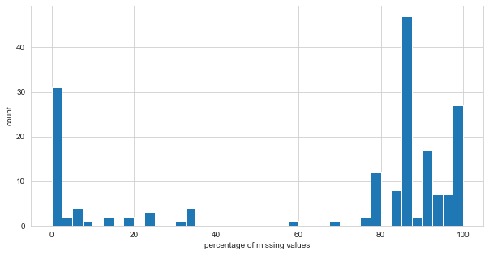


Below, the output shows that 143 of the features with missing values are of type `float64`, while 20 of them are of type `object`.


```python
market_control_df[market_control_df["missing"] != 0]["type"].value_counts()
```


    float64    143
    object      20
    Name: type, dtype: int64


How many features have a percentage of missing values equal or higher than 50%?


```python
market_control_df[(market_control_df["missing_percentage"] >= 50) & (market_control_df["type"] == "float64")].shape[0]
```


    130


```python
market_control_df[(market_control_df["missing_percentage"] >= 50) & (market_control_df["type"] == "object")].shape[0]
```


    1


130 of the `float64` features and 1 `object` feature have 50% or more missing values. The decision, as a rule of thumb, is to drop these from the market dataset.


```python
columns_to_drop = market_control_df[(market_control_df["missing_percentage"] >= 50)].index
market_df.drop(columns_to_drop, axis=1, inplace=True)
market_control_df = create_control_df(market_df)

print(f"The percentage of missing values in the market dataset is {round(100*(market_df.isna().sum().sum() / market_df.size))} %")
```

    The percentage of missing values in the market dataset is 7 %
    

Later, the remaining missing values of each type of feature will be addressed.

### <a name="crapfeatures1">2.4 Identifying ID and Constant Features </a>

The code below identifies features with a number equal to the number of observations (i.e. behaves as an ID for the companies), and features with constant observations (i.e. all observatios are equal, which will not help any model to generalize predictions/classifications/etc.).  
The feature `id` is the only one that behaves as an identifier to the companies. We'll assign it to a separate variable called `IDs`.  
The feature `fl_epp` is the only one that has equal values for each observation, thus it'll be dropped from the dataset.


```python
id_features = list(market_control_df[market_control_df["unique"] == market_df.shape[0]].index)
constant_features = list(market_control_df[market_control_df["unique"] == 1].index)
print(f"The identifier feature{'s are' if len(id_features) > 1 else ' is'} {id_features}")
print(f"The constant feature{'s are' if len(constant_features) > 1 else ' is'} {constant_features}")

IDs = market_df[id_features]
IDs.columns.name = ''
market_df.drop(constant_features + id_features, axis=1, inplace=True)
market_control_df = create_control_df(market_df)
```

    The identifier feature is ['id']
    The constant feature is ['fl_epp']
    

Below, the unique values for each categorical variable is shown.  
The variable `dt_situacao` has too many classes for a categorical variable, this may cause problems later on while imputing values. The feature dictionary indicates that it represents dates when "de_situacao" was registered by the IRS, but it has no more references to "de_situacao", so we'll just drop it.


```python
market_control_df.loc[(market_control_df["type"] == "object") | (market_control_df["type"] == "bool"), "unique"].sort_values(ascending=False).head()
```


    features
    dt_situacao             7334
    nm_divisao                87
    nm_micro_regiao           73
    de_natureza_juridica      67
    de_ramo                   33
    Name: unique, dtype: int64


```python
market_df.drop("dt_situacao", axis=1, inplace=True)
```


```python
market_control_df.loc[(market_control_df["type"] == "float64") | (market_control_df["type"] == "int64"), "unique"].sort_values(ascending=False)
```


    features
    empsetorcensitariofaixarendapopulacao    15419
    idade_empresa_anos                       14198
    vl_faturamento_estimado_grupo_aux         6794
    vl_faturamento_estimado_aux               1920
    idade_media_socios                        1010
    vl_total_veiculos_leves_grupo              310
    qt_filiais                                 304
    vl_total_veiculos_pesados_grupo            296
    idade_maxima_socios                        118
    idade_minima_socios                        114
    qt_socios_pf                                64
    qt_socios                                   62
    qt_socios_st_regular                        54
    nu_meses_rescencia                          51
    qt_socios_pj                                12
    Name: unique, dtype: int64


### <a name="types">2.5 Verifying Features' Types </a>

Next, we'll evaluate the features' characteristics, modify their types as necessary, and create lists with features' names by type.


```python
market_control_df = create_control_df(market_df)
```

#### <a name="floatfeat">2.5.1 Float Features </a>


```python
market_control_df[market_control_df["type"] == "float64"]
```


<div>
<style scoped>
    .dataframe tbody tr th:only-of-type {
        vertical-align: middle;
    }

    .dataframe tbody tr th {
        vertical-align: top;
    }

    .dataframe thead th {
        text-align: right;
    }
</style>
<table border="1" class="dataframe">
  <thead>
    <tr style="text-align: right;">
      <th></th>
      <th>missing</th>
      <th>missing_percentage</th>
      <th>type</th>
      <th>unique</th>
      <th>unique_percentage</th>
    </tr>
    <tr>
      <th>features</th>
      <th></th>
      <th></th>
      <th></th>
      <th></th>
      <th></th>
    </tr>
  </thead>
  <tbody>
    <tr>
      <th>idade_empresa_anos</th>
      <td>0</td>
      <td>0.000</td>
      <td>float64</td>
      <td>14198</td>
      <td>3.0712</td>
    </tr>
    <tr>
      <th>vl_total_veiculos_pesados_grupo</th>
      <td>1927</td>
      <td>0.417</td>
      <td>float64</td>
      <td>296</td>
      <td>0.0640</td>
    </tr>
    <tr>
      <th>vl_total_veiculos_leves_grupo</th>
      <td>1927</td>
      <td>0.417</td>
      <td>float64</td>
      <td>310</td>
      <td>0.0671</td>
    </tr>
    <tr>
      <th>nu_meses_rescencia</th>
      <td>45276</td>
      <td>9.794</td>
      <td>float64</td>
      <td>51</td>
      <td>0.0110</td>
    </tr>
    <tr>
      <th>empsetorcensitariofaixarendapopulacao</th>
      <td>143829</td>
      <td>31.112</td>
      <td>float64</td>
      <td>15419</td>
      <td>3.3353</td>
    </tr>
    <tr>
      <th>qt_socios</th>
      <td>115091</td>
      <td>24.895</td>
      <td>float64</td>
      <td>62</td>
      <td>0.0134</td>
    </tr>
    <tr>
      <th>qt_socios_pf</th>
      <td>115091</td>
      <td>24.895</td>
      <td>float64</td>
      <td>64</td>
      <td>0.0138</td>
    </tr>
    <tr>
      <th>qt_socios_pj</th>
      <td>115091</td>
      <td>24.895</td>
      <td>float64</td>
      <td>12</td>
      <td>0.0026</td>
    </tr>
    <tr>
      <th>idade_media_socios</th>
      <td>151602</td>
      <td>32.793</td>
      <td>float64</td>
      <td>1010</td>
      <td>0.2185</td>
    </tr>
    <tr>
      <th>idade_maxima_socios</th>
      <td>151602</td>
      <td>32.793</td>
      <td>float64</td>
      <td>118</td>
      <td>0.0255</td>
    </tr>
    <tr>
      <th>idade_minima_socios</th>
      <td>151602</td>
      <td>32.793</td>
      <td>float64</td>
      <td>114</td>
      <td>0.0247</td>
    </tr>
    <tr>
      <th>qt_socios_st_regular</th>
      <td>154917</td>
      <td>33.510</td>
      <td>float64</td>
      <td>54</td>
      <td>0.0117</td>
    </tr>
    <tr>
      <th>vl_faturamento_estimado_aux</th>
      <td>27513</td>
      <td>5.951</td>
      <td>float64</td>
      <td>1920</td>
      <td>0.4153</td>
    </tr>
    <tr>
      <th>vl_faturamento_estimado_grupo_aux</th>
      <td>27513</td>
      <td>5.951</td>
      <td>float64</td>
      <td>6794</td>
      <td>1.4696</td>
    </tr>
  </tbody>
</table>
</div>


The code below assigns the names of float features to the list `float_features`, and the names if float features with missing values to `float_features_with_missing`. It also creates a table describing the float features.  
Checking their mean and median values through the next table, it's possible to infer that their distributions are right skewed (overall, means > medians).  
Also, the features `idade_media_socios`, `idade_maxima_socios`, `idade_minima_socios`, which represent ages, have negative minimum values.


```python
float_features = list(market_control_df[market_control_df["type"] == "float64"].index)

float_features_with_missing = float_features.copy()
float_features_with_missing.remove("idade_empresa_anos")

market_df[float_features].describe()
```


<div>
<style scoped>
    .dataframe tbody tr th:only-of-type {
        vertical-align: middle;
    }

    .dataframe tbody tr th {
        vertical-align: top;
    }

    .dataframe thead th {
        text-align: right;
    }
</style>
<table border="1" class="dataframe">
  <thead>
    <tr style="text-align: right;">
      <th>features</th>
      <th>idade_empresa_anos</th>
      <th>vl_total_veiculos_pesados_grupo</th>
      <th>vl_total_veiculos_leves_grupo</th>
      <th>nu_meses_rescencia</th>
      <th>empsetorcensitariofaixarendapopulacao</th>
      <th>qt_socios</th>
      <th>qt_socios_pf</th>
      <th>qt_socios_pj</th>
      <th>idade_media_socios</th>
      <th>idade_maxima_socios</th>
      <th>idade_minima_socios</th>
      <th>qt_socios_st_regular</th>
      <th>vl_faturamento_estimado_aux</th>
      <th>vl_faturamento_estimado_grupo_aux</th>
    </tr>
  </thead>
  <tbody>
    <tr>
      <th>count</th>
      <td>462298.000000</td>
      <td>460371.000000</td>
      <td>460371.000000</td>
      <td>417022.000000</td>
      <td>318469.000000</td>
      <td>347207.000000</td>
      <td>347207.000000</td>
      <td>347207.000000</td>
      <td>310696.000000</td>
      <td>310696.000000</td>
      <td>310696.000000</td>
      <td>307381.000000</td>
      <td>4.347850e+05</td>
      <td>4.347850e+05</td>
    </tr>
    <tr>
      <th>mean</th>
      <td>9.948677</td>
      <td>3.591801</td>
      <td>48.699177</td>
      <td>25.007247</td>
      <td>1308.005725</td>
      <td>1.496326</td>
      <td>1.476681</td>
      <td>0.019645</td>
      <td>42.816452</td>
      <td>44.344131</td>
      <td>41.355225</td>
      <td>1.396082</td>
      <td>8.020911e+05</td>
      <td>3.367205e+08</td>
    </tr>
    <tr>
      <th>std</th>
      <td>9.615664</td>
      <td>72.600352</td>
      <td>1206.696804</td>
      <td>9.679799</td>
      <td>1161.889222</td>
      <td>3.276626</td>
      <td>3.258079</td>
      <td>0.195166</td>
      <td>12.626447</td>
      <td>13.930385</td>
      <td>12.514921</td>
      <td>2.578793</td>
      <td>3.099979e+07</td>
      <td>7.114614e+09</td>
    </tr>
    <tr>
      <th>min</th>
      <td>0.016438</td>
      <td>0.000000</td>
      <td>0.000000</td>
      <td>0.000000</td>
      <td>100.000000</td>
      <td>1.000000</td>
      <td>0.000000</td>
      <td>0.000000</td>
      <td>-2.000000</td>
      <td>-2.000000</td>
      <td>-2.000000</td>
      <td>1.000000</td>
      <td>0.000000e+00</td>
      <td>4.104703e+04</td>
    </tr>
    <tr>
      <th>25%</th>
      <td>2.756164</td>
      <td>0.000000</td>
      <td>0.000000</td>
      <td>22.000000</td>
      <td>673.230000</td>
      <td>1.000000</td>
      <td>1.000000</td>
      <td>0.000000</td>
      <td>33.000000</td>
      <td>34.000000</td>
      <td>32.000000</td>
      <td>1.000000</td>
      <td>1.648512e+05</td>
      <td>1.854576e+05</td>
    </tr>
    <tr>
      <th>50%</th>
      <td>6.704110</td>
      <td>0.000000</td>
      <td>0.000000</td>
      <td>23.000000</td>
      <td>946.680000</td>
      <td>1.000000</td>
      <td>1.000000</td>
      <td>0.000000</td>
      <td>42.000000</td>
      <td>43.000000</td>
      <td>40.000000</td>
      <td>1.000000</td>
      <td>2.100000e+05</td>
      <td>2.100000e+05</td>
    </tr>
    <tr>
      <th>75%</th>
      <td>14.465753</td>
      <td>0.000000</td>
      <td>0.000000</td>
      <td>25.000000</td>
      <td>1518.080000</td>
      <td>2.000000</td>
      <td>2.000000</td>
      <td>0.000000</td>
      <td>51.000000</td>
      <td>54.000000</td>
      <td>50.000000</td>
      <td>1.000000</td>
      <td>2.100000e+05</td>
      <td>2.100000e+05</td>
    </tr>
    <tr>
      <th>max</th>
      <td>106.432877</td>
      <td>9782.000000</td>
      <td>122090.000000</td>
      <td>66.000000</td>
      <td>75093.840000</td>
      <td>246.000000</td>
      <td>246.000000</td>
      <td>13.000000</td>
      <td>127.000000</td>
      <td>127.000000</td>
      <td>127.000000</td>
      <td>179.000000</td>
      <td>1.454662e+10</td>
      <td>2.227618e+11</td>
    </tr>
  </tbody>
</table>
</div>


```python
def create_distplots(df, features):
    """
    Shows a grid with subplots containing the distribution plots for every feature in the list.
    :param df: Pandas DataFrame containing the data.
    :param features: list or similar containing the continuous numeric features names.
    """
    if len(features) == 1:
        plt.figure(figsize=(20, 4.3))
        sns.distplot(df[features[0]], hist_kws={"alpha":1}, kde=False)
        plt.xlabel(features[0])
        plt.ylabel("count")
    else:
        nrows = len(features)//2
        ncols = 2
        n_figures = len(features)-1
        if len(features) % 2 != 0:
            nrows += 1
        fig, axs = plt.subplots(nrows=nrows, ncols=ncols, figsize=(20, nrows*4.3))

        flag = 0
        while flag <= n_figures:
            for pos_row in range(nrows):
                for pos_col in range(ncols):
                    if nrows == 1:
                        ax = axs[pos_col]
                    else:
                        ax = axs[pos_row, pos_col]
                    if (len(features)%2 != 0) and (pos_row == nrows-1) and (pos_col == 1):
                        flag+=1
                        continue
                    sns.distplot(df[features[flag]], ax=ax, hist_kws={"alpha":1}, kde=False)
                    plt.xlabel(features[flag])
                    plt.ylabel("count")
                    flag+=1
```


```python
create_distplots(market_df, float_features)
```


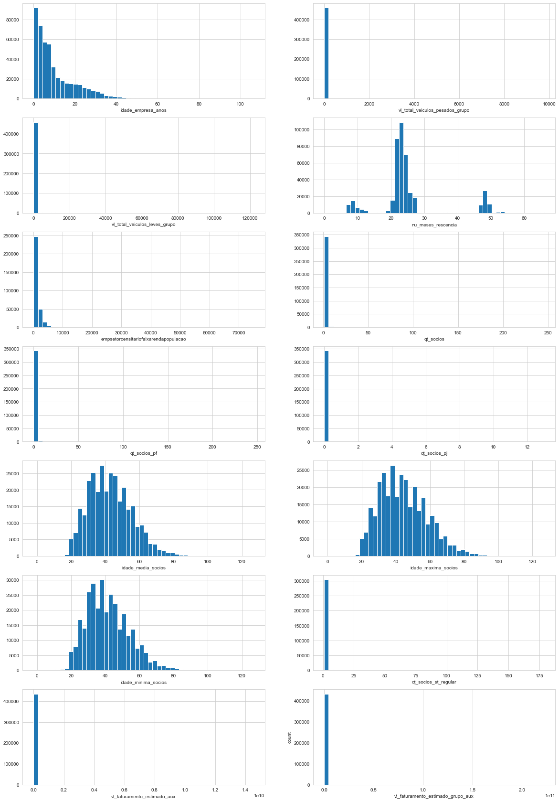


Through the graphics and tables above it's possible to infer:  
* we confirm that the distributions are right skewed. Some have most values grouped together near 0.  
* Observing the x axis, it's possible to infer that some features present very extreme values.  
* The feature `nu_meses_rescencia` draws attention to it's three peaks, it's a multimodal distribution. 
* The features `idade_media_socios`, `idade_maxima_socios`, `idade_minima_socios` may be represented by a log-normal distribution.   
* Some present missing values.  

Since `idade_media_socios`, `idade_maxima_socios`, `idade_minima_socios` represent people ages it should not have negative values. In the next code block we change the negative values to the most common values under 20, which seems like a good threshold considering the graphics.


```python
age_features = "idade_media_socios, idade_maxima_socios, idade_minima_socios".split(", ")
for feature in age_features:
    most_common_under_20 = market_df.loc[market_df[feature] <= 20, feature].value_counts().idxmax()
    print(f"{feature} most common under 20:\n{most_common_under_20}\n")
    market_df.loc[market_df[feature] <= 0, feature] = most_common_under_20 
```

    idade_media_socios most common under 20:
    20.0
    
    idade_maxima_socios most common under 20:
    20.0
    
    idade_minima_socios most common under 20:
    20.0
    
    

#### <a name="intfeat">2.5.2 Integer Features </a>


```python
market_control_df[market_control_df["type"] == "int64"]
```


<div>
<style scoped>
    .dataframe tbody tr th:only-of-type {
        vertical-align: middle;
    }

    .dataframe tbody tr th {
        vertical-align: top;
    }

    .dataframe thead th {
        text-align: right;
    }
</style>
<table border="1" class="dataframe">
  <thead>
    <tr style="text-align: right;">
      <th></th>
      <th>missing</th>
      <th>missing_percentage</th>
      <th>type</th>
      <th>unique</th>
      <th>unique_percentage</th>
    </tr>
    <tr>
      <th>features</th>
      <th></th>
      <th></th>
      <th></th>
      <th></th>
      <th></th>
    </tr>
  </thead>
  <tbody>
    <tr>
      <th>qt_filiais</th>
      <td>0</td>
      <td>0.0</td>
      <td>int64</td>
      <td>304</td>
      <td>0.0658</td>
    </tr>
  </tbody>
</table>
</div>


The code below assigns the name of integer features to the `integer_features` list. It also creates a table describing the feature.   
It's possible to infer that it's distributions is right skewed (overall, means > medians), much like the float features observed.  
There are no missing values in the feature.


```python
integer_features = list(market_control_df[market_control_df["type"] == "int64"].index)

market_df[integer_features].describe()
```


<div>
<style scoped>
    .dataframe tbody tr th:only-of-type {
        vertical-align: middle;
    }

    .dataframe tbody tr th {
        vertical-align: top;
    }

    .dataframe thead th {
        text-align: right;
    }
</style>
<table border="1" class="dataframe">
  <thead>
    <tr style="text-align: right;">
      <th>features</th>
      <th>qt_filiais</th>
    </tr>
  </thead>
  <tbody>
    <tr>
      <th>count</th>
      <td>462298.000000</td>
    </tr>
    <tr>
      <th>mean</th>
      <td>28.737044</td>
    </tr>
    <tr>
      <th>std</th>
      <td>468.626094</td>
    </tr>
    <tr>
      <th>min</th>
      <td>0.000000</td>
    </tr>
    <tr>
      <th>25%</th>
      <td>0.000000</td>
    </tr>
    <tr>
      <th>50%</th>
      <td>0.000000</td>
    </tr>
    <tr>
      <th>75%</th>
      <td>0.000000</td>
    </tr>
    <tr>
      <th>max</th>
      <td>9647.000000</td>
    </tr>
  </tbody>
</table>
</div>


```python
create_distplots(market_df, integer_features)
```


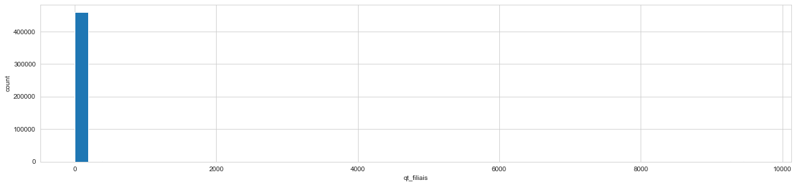


#### <a name="catfeat">2.5.3 Categorical Features </a>


```python
market_control_df[(market_control_df["type"] == "object") | (market_control_df["type"] == "bool")]
```


<div>
<style scoped>
    .dataframe tbody tr th:only-of-type {
        vertical-align: middle;
    }

    .dataframe tbody tr th {
        vertical-align: top;
    }

    .dataframe thead th {
        text-align: right;
    }
</style>
<table border="1" class="dataframe">
  <thead>
    <tr style="text-align: right;">
      <th></th>
      <th>missing</th>
      <th>missing_percentage</th>
      <th>type</th>
      <th>unique</th>
      <th>unique_percentage</th>
    </tr>
    <tr>
      <th>features</th>
      <th></th>
      <th></th>
      <th></th>
      <th></th>
      <th></th>
    </tr>
  </thead>
  <tbody>
    <tr>
      <th>fl_matriz</th>
      <td>0</td>
      <td>0.000</td>
      <td>bool</td>
      <td>2</td>
      <td>0.0004</td>
    </tr>
    <tr>
      <th>de_natureza_juridica</th>
      <td>0</td>
      <td>0.000</td>
      <td>object</td>
      <td>67</td>
      <td>0.0145</td>
    </tr>
    <tr>
      <th>sg_uf</th>
      <td>0</td>
      <td>0.000</td>
      <td>object</td>
      <td>6</td>
      <td>0.0013</td>
    </tr>
    <tr>
      <th>natureza_juridica_macro</th>
      <td>0</td>
      <td>0.000</td>
      <td>object</td>
      <td>7</td>
      <td>0.0015</td>
    </tr>
    <tr>
      <th>de_ramo</th>
      <td>0</td>
      <td>0.000</td>
      <td>object</td>
      <td>33</td>
      <td>0.0071</td>
    </tr>
    <tr>
      <th>setor</th>
      <td>1927</td>
      <td>0.417</td>
      <td>object</td>
      <td>5</td>
      <td>0.0011</td>
    </tr>
    <tr>
      <th>idade_emp_cat</th>
      <td>0</td>
      <td>0.000</td>
      <td>object</td>
      <td>6</td>
      <td>0.0013</td>
    </tr>
    <tr>
      <th>fl_me</th>
      <td>0</td>
      <td>0.000</td>
      <td>bool</td>
      <td>2</td>
      <td>0.0004</td>
    </tr>
    <tr>
      <th>fl_sa</th>
      <td>0</td>
      <td>0.000</td>
      <td>bool</td>
      <td>2</td>
      <td>0.0004</td>
    </tr>
    <tr>
      <th>fl_mei</th>
      <td>0</td>
      <td>0.000</td>
      <td>bool</td>
      <td>2</td>
      <td>0.0004</td>
    </tr>
    <tr>
      <th>fl_ltda</th>
      <td>0</td>
      <td>0.000</td>
      <td>bool</td>
      <td>2</td>
      <td>0.0004</td>
    </tr>
    <tr>
      <th>fl_st_especial</th>
      <td>0</td>
      <td>0.000</td>
      <td>bool</td>
      <td>2</td>
      <td>0.0004</td>
    </tr>
    <tr>
      <th>fl_email</th>
      <td>0</td>
      <td>0.000</td>
      <td>bool</td>
      <td>2</td>
      <td>0.0004</td>
    </tr>
    <tr>
      <th>fl_telefone</th>
      <td>0</td>
      <td>0.000</td>
      <td>bool</td>
      <td>2</td>
      <td>0.0004</td>
    </tr>
    <tr>
      <th>fl_rm</th>
      <td>0</td>
      <td>0.000</td>
      <td>object</td>
      <td>2</td>
      <td>0.0004</td>
    </tr>
    <tr>
      <th>nm_divisao</th>
      <td>1927</td>
      <td>0.417</td>
      <td>object</td>
      <td>87</td>
      <td>0.0188</td>
    </tr>
    <tr>
      <th>nm_segmento</th>
      <td>1927</td>
      <td>0.417</td>
      <td>object</td>
      <td>21</td>
      <td>0.0045</td>
    </tr>
    <tr>
      <th>fl_spa</th>
      <td>1927</td>
      <td>0.417</td>
      <td>object</td>
      <td>2</td>
      <td>0.0004</td>
    </tr>
    <tr>
      <th>fl_antt</th>
      <td>1927</td>
      <td>0.417</td>
      <td>object</td>
      <td>2</td>
      <td>0.0004</td>
    </tr>
    <tr>
      <th>fl_veiculo</th>
      <td>1927</td>
      <td>0.417</td>
      <td>object</td>
      <td>2</td>
      <td>0.0004</td>
    </tr>
    <tr>
      <th>fl_optante_simples</th>
      <td>82713</td>
      <td>17.892</td>
      <td>object</td>
      <td>2</td>
      <td>0.0004</td>
    </tr>
    <tr>
      <th>fl_optante_simei</th>
      <td>82713</td>
      <td>17.892</td>
      <td>object</td>
      <td>2</td>
      <td>0.0004</td>
    </tr>
    <tr>
      <th>sg_uf_matriz</th>
      <td>1939</td>
      <td>0.419</td>
      <td>object</td>
      <td>27</td>
      <td>0.0058</td>
    </tr>
    <tr>
      <th>de_saude_tributaria</th>
      <td>14851</td>
      <td>3.212</td>
      <td>object</td>
      <td>6</td>
      <td>0.0013</td>
    </tr>
    <tr>
      <th>de_saude_rescencia</th>
      <td>14851</td>
      <td>3.212</td>
      <td>object</td>
      <td>5</td>
      <td>0.0011</td>
    </tr>
    <tr>
      <th>de_nivel_atividade</th>
      <td>11168</td>
      <td>2.416</td>
      <td>object</td>
      <td>4</td>
      <td>0.0009</td>
    </tr>
    <tr>
      <th>fl_simples_irregular</th>
      <td>1927</td>
      <td>0.417</td>
      <td>object</td>
      <td>2</td>
      <td>0.0004</td>
    </tr>
    <tr>
      <th>nm_meso_regiao</th>
      <td>58698</td>
      <td>12.697</td>
      <td>object</td>
      <td>19</td>
      <td>0.0041</td>
    </tr>
    <tr>
      <th>nm_micro_regiao</th>
      <td>58698</td>
      <td>12.697</td>
      <td>object</td>
      <td>73</td>
      <td>0.0158</td>
    </tr>
    <tr>
      <th>fl_passivel_iss</th>
      <td>1927</td>
      <td>0.417</td>
      <td>object</td>
      <td>2</td>
      <td>0.0004</td>
    </tr>
    <tr>
      <th>de_faixa_faturamento_estimado</th>
      <td>27513</td>
      <td>5.951</td>
      <td>object</td>
      <td>12</td>
      <td>0.0026</td>
    </tr>
    <tr>
      <th>de_faixa_faturamento_estimado_grupo</th>
      <td>27513</td>
      <td>5.951</td>
      <td>object</td>
      <td>11</td>
      <td>0.0024</td>
    </tr>
  </tbody>
</table>
</div>


The table above shows that some features of type object have only two unique values. Usually, this is associated with boolean features. In the next code block we take a closer look and confirm that these are all actually boolean features. Their names' are stored in the `boolean_features` list, along with the features that were already of type bool, and the names of the boolean features with missing values are stored in `boolean_features_with_missing`.


```python
boolean_features = list(market_control_df[
    ((market_control_df["type"] == "object") | (market_control_df["type"] == "bool"))
    & (market_control_df["unique"] == 2)].index)

boolean_features_with_missing = list(market_control_df[
    ((market_control_df["type"] == "object") | (market_control_df["type"] == "bool"))
    & (market_control_df["unique"] == 2) & (market_control_df["missing"] != 0)].index)

market_df[boolean_features].describe()
```


<div>
<style scoped>
    .dataframe tbody tr th:only-of-type {
        vertical-align: middle;
    }

    .dataframe tbody tr th {
        vertical-align: top;
    }

    .dataframe thead th {
        text-align: right;
    }
</style>
<table border="1" class="dataframe">
  <thead>
    <tr style="text-align: right;">
      <th>features</th>
      <th>fl_matriz</th>
      <th>fl_me</th>
      <th>fl_sa</th>
      <th>fl_mei</th>
      <th>fl_ltda</th>
      <th>fl_st_especial</th>
      <th>fl_email</th>
      <th>fl_telefone</th>
      <th>fl_rm</th>
      <th>fl_spa</th>
      <th>fl_antt</th>
      <th>fl_veiculo</th>
      <th>fl_optante_simples</th>
      <th>fl_optante_simei</th>
      <th>fl_simples_irregular</th>
      <th>fl_passivel_iss</th>
    </tr>
  </thead>
  <tbody>
    <tr>
      <th>count</th>
      <td>462298</td>
      <td>462298</td>
      <td>462298</td>
      <td>462298</td>
      <td>462298</td>
      <td>462298</td>
      <td>462298</td>
      <td>462298</td>
      <td>462298</td>
      <td>460371</td>
      <td>460371</td>
      <td>460371</td>
      <td>379585</td>
      <td>379585</td>
      <td>460371</td>
      <td>460371</td>
    </tr>
    <tr>
      <th>unique</th>
      <td>2</td>
      <td>2</td>
      <td>2</td>
      <td>2</td>
      <td>2</td>
      <td>2</td>
      <td>2</td>
      <td>2</td>
      <td>2</td>
      <td>2</td>
      <td>2</td>
      <td>2</td>
      <td>2</td>
      <td>2</td>
      <td>2</td>
      <td>2</td>
    </tr>
    <tr>
      <th>top</th>
      <td>True</td>
      <td>False</td>
      <td>False</td>
      <td>False</td>
      <td>False</td>
      <td>False</td>
      <td>False</td>
      <td>True</td>
      <td>NAO</td>
      <td>False</td>
      <td>False</td>
      <td>False</td>
      <td>True</td>
      <td>False</td>
      <td>False</td>
      <td>True</td>
    </tr>
    <tr>
      <th>freq</th>
      <td>433232</td>
      <td>461083</td>
      <td>453866</td>
      <td>311398</td>
      <td>461056</td>
      <td>462230</td>
      <td>256228</td>
      <td>335468</td>
      <td>236779</td>
      <td>460091</td>
      <td>457095</td>
      <td>429687</td>
      <td>199617</td>
      <td>285545</td>
      <td>460030</td>
      <td>264741</td>
    </tr>
  </tbody>
</table>
</div>


The boolean feature `fl_rm` is of type object and presents the top value as "NAO" ("NO" in portuguese). We'll transform this and the other boolean features into 0s and 1s.


```python
temp_onehot = OneHotEncoder(drop="if_binary", sparse=False, dtype=np.float)
market_df.loc[:, "fl_rm"] = temp_onehot.fit_transform(market_df[["fl_rm"]])
market_df.loc[:, boolean_features] = market_df[boolean_features].astype(np.float)
market_df[boolean_features].describe()
```


<div>
<style scoped>
    .dataframe tbody tr th:only-of-type {
        vertical-align: middle;
    }

    .dataframe tbody tr th {
        vertical-align: top;
    }

    .dataframe thead th {
        text-align: right;
    }
</style>
<table border="1" class="dataframe">
  <thead>
    <tr style="text-align: right;">
      <th>features</th>
      <th>fl_matriz</th>
      <th>fl_me</th>
      <th>fl_sa</th>
      <th>fl_mei</th>
      <th>fl_ltda</th>
      <th>fl_st_especial</th>
      <th>fl_email</th>
      <th>fl_telefone</th>
      <th>fl_rm</th>
      <th>fl_spa</th>
      <th>fl_antt</th>
      <th>fl_veiculo</th>
      <th>fl_optante_simples</th>
      <th>fl_optante_simei</th>
      <th>fl_simples_irregular</th>
      <th>fl_passivel_iss</th>
    </tr>
  </thead>
  <tbody>
    <tr>
      <th>count</th>
      <td>462298.000000</td>
      <td>462298.000000</td>
      <td>462298.000000</td>
      <td>462298.000000</td>
      <td>462298.000000</td>
      <td>462298.000000</td>
      <td>462298.000000</td>
      <td>462298.000000</td>
      <td>462298.000000</td>
      <td>460371.000000</td>
      <td>460371.000000</td>
      <td>460371.000000</td>
      <td>379585.000000</td>
      <td>379585.000000</td>
      <td>460371.000000</td>
      <td>460371.000000</td>
    </tr>
    <tr>
      <th>mean</th>
      <td>0.937127</td>
      <td>0.002628</td>
      <td>0.018239</td>
      <td>0.326413</td>
      <td>0.002687</td>
      <td>0.000147</td>
      <td>0.445751</td>
      <td>0.725653</td>
      <td>0.487822</td>
      <td>0.000608</td>
      <td>0.007116</td>
      <td>0.066651</td>
      <td>0.525882</td>
      <td>0.247744</td>
      <td>0.000741</td>
      <td>0.575060</td>
    </tr>
    <tr>
      <th>std</th>
      <td>0.242734</td>
      <td>0.051198</td>
      <td>0.133816</td>
      <td>0.468901</td>
      <td>0.051763</td>
      <td>0.012127</td>
      <td>0.497049</td>
      <td>0.446185</td>
      <td>0.499852</td>
      <td>0.024654</td>
      <td>0.084056</td>
      <td>0.249416</td>
      <td>0.499330</td>
      <td>0.431703</td>
      <td>0.027206</td>
      <td>0.494334</td>
    </tr>
    <tr>
      <th>min</th>
      <td>0.000000</td>
      <td>0.000000</td>
      <td>0.000000</td>
      <td>0.000000</td>
      <td>0.000000</td>
      <td>0.000000</td>
      <td>0.000000</td>
      <td>0.000000</td>
      <td>0.000000</td>
      <td>0.000000</td>
      <td>0.000000</td>
      <td>0.000000</td>
      <td>0.000000</td>
      <td>0.000000</td>
      <td>0.000000</td>
      <td>0.000000</td>
    </tr>
    <tr>
      <th>25%</th>
      <td>1.000000</td>
      <td>0.000000</td>
      <td>0.000000</td>
      <td>0.000000</td>
      <td>0.000000</td>
      <td>0.000000</td>
      <td>0.000000</td>
      <td>0.000000</td>
      <td>0.000000</td>
      <td>0.000000</td>
      <td>0.000000</td>
      <td>0.000000</td>
      <td>0.000000</td>
      <td>0.000000</td>
      <td>0.000000</td>
      <td>0.000000</td>
    </tr>
    <tr>
      <th>50%</th>
      <td>1.000000</td>
      <td>0.000000</td>
      <td>0.000000</td>
      <td>0.000000</td>
      <td>0.000000</td>
      <td>0.000000</td>
      <td>0.000000</td>
      <td>1.000000</td>
      <td>0.000000</td>
      <td>0.000000</td>
      <td>0.000000</td>
      <td>0.000000</td>
      <td>1.000000</td>
      <td>0.000000</td>
      <td>0.000000</td>
      <td>1.000000</td>
    </tr>
    <tr>
      <th>75%</th>
      <td>1.000000</td>
      <td>0.000000</td>
      <td>0.000000</td>
      <td>1.000000</td>
      <td>0.000000</td>
      <td>0.000000</td>
      <td>1.000000</td>
      <td>1.000000</td>
      <td>1.000000</td>
      <td>0.000000</td>
      <td>0.000000</td>
      <td>0.000000</td>
      <td>1.000000</td>
      <td>0.000000</td>
      <td>0.000000</td>
      <td>1.000000</td>
    </tr>
    <tr>
      <th>max</th>
      <td>1.000000</td>
      <td>1.000000</td>
      <td>1.000000</td>
      <td>1.000000</td>
      <td>1.000000</td>
      <td>1.000000</td>
      <td>1.000000</td>
      <td>1.000000</td>
      <td>1.000000</td>
      <td>1.000000</td>
      <td>1.000000</td>
      <td>1.000000</td>
      <td>1.000000</td>
      <td>1.000000</td>
      <td>1.000000</td>
      <td>1.000000</td>
    </tr>
  </tbody>
</table>
</div>


The remaining object features are described in the table below. Their names are stored as `object_features`, and the object features that have missing values are assigned to `object_features_with_missing`.


```python
object_features = list(market_control_df[
    (market_control_df["type"] == "object") & (market_control_df["unique"] > 2)
].index)

object_features_with_missing = list(market_control_df[
    (market_control_df["type"] == "object") & (market_control_df["unique"] > 2) & (market_control_df["missing"] != 0)].index)

market_df[object_features].describe().T
```


<div>
<style scoped>
    .dataframe tbody tr th:only-of-type {
        vertical-align: middle;
    }

    .dataframe tbody tr th {
        vertical-align: top;
    }

    .dataframe thead th {
        text-align: right;
    }
</style>
<table border="1" class="dataframe">
  <thead>
    <tr style="text-align: right;">
      <th></th>
      <th>count</th>
      <th>unique</th>
      <th>top</th>
      <th>freq</th>
    </tr>
    <tr>
      <th>features</th>
      <th></th>
      <th></th>
      <th></th>
      <th></th>
    </tr>
  </thead>
  <tbody>
    <tr>
      <th>de_natureza_juridica</th>
      <td>462298</td>
      <td>67</td>
      <td>EMPRESARIO INDIVIDUAL</td>
      <td>295756</td>
    </tr>
    <tr>
      <th>sg_uf</th>
      <td>462298</td>
      <td>6</td>
      <td>MA</td>
      <td>127654</td>
    </tr>
    <tr>
      <th>natureza_juridica_macro</th>
      <td>462298</td>
      <td>7</td>
      <td>OUTROS</td>
      <td>320211</td>
    </tr>
    <tr>
      <th>de_ramo</th>
      <td>462298</td>
      <td>33</td>
      <td>COMERCIO VAREJISTA</td>
      <td>172404</td>
    </tr>
    <tr>
      <th>setor</th>
      <td>460371</td>
      <td>5</td>
      <td>COMERCIO</td>
      <td>211224</td>
    </tr>
    <tr>
      <th>idade_emp_cat</th>
      <td>462298</td>
      <td>6</td>
      <td>1 a 5</td>
      <td>138580</td>
    </tr>
    <tr>
      <th>nm_divisao</th>
      <td>460371</td>
      <td>87</td>
      <td>COMERCIO VAREJISTA</td>
      <td>172404</td>
    </tr>
    <tr>
      <th>nm_segmento</th>
      <td>460371</td>
      <td>21</td>
      <td>COMERCIO; REPARACAO DE VEICULOS AUTOMOTORES E ...</td>
      <td>211224</td>
    </tr>
    <tr>
      <th>sg_uf_matriz</th>
      <td>460359</td>
      <td>27</td>
      <td>MA</td>
      <td>124823</td>
    </tr>
    <tr>
      <th>de_saude_tributaria</th>
      <td>447447</td>
      <td>6</td>
      <td>VERDE</td>
      <td>145430</td>
    </tr>
    <tr>
      <th>de_saude_rescencia</th>
      <td>447447</td>
      <td>5</td>
      <td>ACIMA DE 1 ANO</td>
      <td>378896</td>
    </tr>
    <tr>
      <th>de_nivel_atividade</th>
      <td>451130</td>
      <td>4</td>
      <td>MEDIA</td>
      <td>217949</td>
    </tr>
    <tr>
      <th>nm_meso_regiao</th>
      <td>403600</td>
      <td>19</td>
      <td>CENTRO AMAZONENSE</td>
      <td>71469</td>
    </tr>
    <tr>
      <th>nm_micro_regiao</th>
      <td>403600</td>
      <td>73</td>
      <td>MANAUS</td>
      <td>60008</td>
    </tr>
    <tr>
      <th>de_faixa_faturamento_estimado</th>
      <td>434785</td>
      <td>12</td>
      <td>DE R$ 81.000,01 A R$ 360.000,00</td>
      <td>273861</td>
    </tr>
    <tr>
      <th>de_faixa_faturamento_estimado_grupo</th>
      <td>434785</td>
      <td>11</td>
      <td>DE R$ 81.000,01 A R$ 360.000,00</td>
      <td>252602</td>
    </tr>
  </tbody>
</table>
</div>


```python
def create_barplots(df, features, n_labels=None):
    """
    Shows a grid with subplots containing barplots for every feature in the list.
    :param df: Pandas DataFrame containing the data.
    :param features: list or similar containing the categorical features names.
    :param n_labels: integer, representes number of features' labels to plot. Uses the n features with more counts in descending order.
    """    
    if len(features) == 1:
        x = df[features].value_counts().head(n_labels)
        y = x.index        
        plt.figure(figsize = (25, 4.3))
        sns.barplot(x = x, y = y)
        plt.xlabel(features[0])
    else:
        n_figures = len(features) - 1
        nrows = len(features)//2
        ncols = 2
        if len(features) % 2 != 0:
            nrows += 1
        fig, axs = plt.subplots(nrows=nrows, ncols=ncols, figsize=(20, nrows*4.5))
        plt.subplots_adjust(wspace=1.25)
        
        flag = 0
        while flag <= n_figures:
            for pos_row in range(nrows):
                for pos_col in range(ncols):
                    if nrows == 1:
                        ax = axs[pos_col]
                    else:
                        ax = axs[pos_row, pos_col]
                    if (len(features)%2 != 0) and (pos_row == nrows-1) and (pos_col == 1):
                        flag+=1
                        continue
                    x = df[features[flag]].value_counts().head(n_labels)
                    y = x.index
                    sns.barplot(x=x, y=y, ax=ax)
                    plt.xlabel(features[flag])
                    flag+=1
```


```python
create_barplots(market_df, object_features, n_labels=10)
```


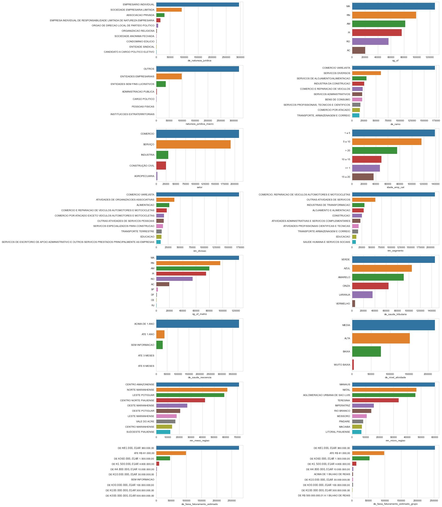


### <a name="missing2">2.6 Imputing Missing Values</a>

Below, it can be seen through the graphic that some remaining features have at least around 35% missing values or less.


```python
market_control_df = create_control_df(market_df)
```


```python
plt.figure(figsize=(10,5))
sns.distplot(market_control_df["missing_percentage"], kde=False, bins = 40, hist_kws={"alpha":1})
plt.xlabel("percentage of missing values")
plt.ylabel("count");
```


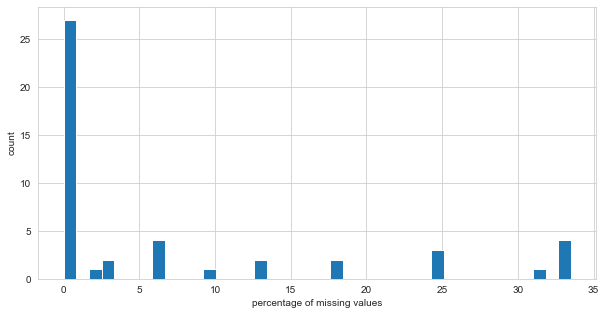


The next output shows that from the remaining 31 features with missing values, 20 are of type `float64`, while 11 of them are of type `object`. Remember that the boolean features were turned into the type float, but they should be treated as categorical.


```python
print(f"From the {market_control_df.shape[0]} remaining features, {market_control_df[market_control_df['missing'] !=0 ].shape[0]} have missing values.")
print(f"\nTheir types are:\n{market_control_df[market_control_df['missing'] != 0]['type'].value_counts()}")
```

    From the 47 remaining features, 31 have missing values.
    
    Their types are:
    float64    20
    object     11
    Name: type, dtype: int64
    

#### <a name="missingnum">2.6.1 Missing Values of Numeric Features</a>  
The folowing table shows the remaining `float64` features and their respective count and percentage of missing values.


```python
market_control_df[(market_control_df["type"] == "float64")].sort_values(by="missing", ascending=False)
```


<div>
<style scoped>
    .dataframe tbody tr th:only-of-type {
        vertical-align: middle;
    }

    .dataframe tbody tr th {
        vertical-align: top;
    }

    .dataframe thead th {
        text-align: right;
    }
</style>
<table border="1" class="dataframe">
  <thead>
    <tr style="text-align: right;">
      <th></th>
      <th>missing</th>
      <th>missing_percentage</th>
      <th>type</th>
      <th>unique</th>
      <th>unique_percentage</th>
    </tr>
    <tr>
      <th>features</th>
      <th></th>
      <th></th>
      <th></th>
      <th></th>
      <th></th>
    </tr>
  </thead>
  <tbody>
    <tr>
      <th>qt_socios_st_regular</th>
      <td>154917</td>
      <td>33.510</td>
      <td>float64</td>
      <td>54</td>
      <td>0.0117</td>
    </tr>
    <tr>
      <th>idade_minima_socios</th>
      <td>151602</td>
      <td>32.793</td>
      <td>float64</td>
      <td>113</td>
      <td>0.0244</td>
    </tr>
    <tr>
      <th>idade_maxima_socios</th>
      <td>151602</td>
      <td>32.793</td>
      <td>float64</td>
      <td>117</td>
      <td>0.0253</td>
    </tr>
    <tr>
      <th>idade_media_socios</th>
      <td>151602</td>
      <td>32.793</td>
      <td>float64</td>
      <td>1009</td>
      <td>0.2183</td>
    </tr>
    <tr>
      <th>empsetorcensitariofaixarendapopulacao</th>
      <td>143829</td>
      <td>31.112</td>
      <td>float64</td>
      <td>15419</td>
      <td>3.3353</td>
    </tr>
    <tr>
      <th>qt_socios_pj</th>
      <td>115091</td>
      <td>24.895</td>
      <td>float64</td>
      <td>12</td>
      <td>0.0026</td>
    </tr>
    <tr>
      <th>qt_socios_pf</th>
      <td>115091</td>
      <td>24.895</td>
      <td>float64</td>
      <td>64</td>
      <td>0.0138</td>
    </tr>
    <tr>
      <th>qt_socios</th>
      <td>115091</td>
      <td>24.895</td>
      <td>float64</td>
      <td>62</td>
      <td>0.0134</td>
    </tr>
    <tr>
      <th>fl_optante_simei</th>
      <td>82713</td>
      <td>17.892</td>
      <td>float64</td>
      <td>2</td>
      <td>0.0004</td>
    </tr>
    <tr>
      <th>fl_optante_simples</th>
      <td>82713</td>
      <td>17.892</td>
      <td>float64</td>
      <td>2</td>
      <td>0.0004</td>
    </tr>
    <tr>
      <th>nu_meses_rescencia</th>
      <td>45276</td>
      <td>9.794</td>
      <td>float64</td>
      <td>51</td>
      <td>0.0110</td>
    </tr>
    <tr>
      <th>vl_faturamento_estimado_grupo_aux</th>
      <td>27513</td>
      <td>5.951</td>
      <td>float64</td>
      <td>6794</td>
      <td>1.4696</td>
    </tr>
    <tr>
      <th>vl_faturamento_estimado_aux</th>
      <td>27513</td>
      <td>5.951</td>
      <td>float64</td>
      <td>1920</td>
      <td>0.4153</td>
    </tr>
    <tr>
      <th>fl_passivel_iss</th>
      <td>1927</td>
      <td>0.417</td>
      <td>float64</td>
      <td>2</td>
      <td>0.0004</td>
    </tr>
    <tr>
      <th>fl_simples_irregular</th>
      <td>1927</td>
      <td>0.417</td>
      <td>float64</td>
      <td>2</td>
      <td>0.0004</td>
    </tr>
    <tr>
      <th>vl_total_veiculos_leves_grupo</th>
      <td>1927</td>
      <td>0.417</td>
      <td>float64</td>
      <td>310</td>
      <td>0.0671</td>
    </tr>
    <tr>
      <th>vl_total_veiculos_pesados_grupo</th>
      <td>1927</td>
      <td>0.417</td>
      <td>float64</td>
      <td>296</td>
      <td>0.0640</td>
    </tr>
    <tr>
      <th>fl_veiculo</th>
      <td>1927</td>
      <td>0.417</td>
      <td>float64</td>
      <td>2</td>
      <td>0.0004</td>
    </tr>
    <tr>
      <th>fl_antt</th>
      <td>1927</td>
      <td>0.417</td>
      <td>float64</td>
      <td>2</td>
      <td>0.0004</td>
    </tr>
    <tr>
      <th>fl_spa</th>
      <td>1927</td>
      <td>0.417</td>
      <td>float64</td>
      <td>2</td>
      <td>0.0004</td>
    </tr>
    <tr>
      <th>idade_empresa_anos</th>
      <td>0</td>
      <td>0.000</td>
      <td>float64</td>
      <td>14198</td>
      <td>3.0712</td>
    </tr>
    <tr>
      <th>fl_rm</th>
      <td>0</td>
      <td>0.000</td>
      <td>float64</td>
      <td>2</td>
      <td>0.0004</td>
    </tr>
    <tr>
      <th>fl_telefone</th>
      <td>0</td>
      <td>0.000</td>
      <td>float64</td>
      <td>2</td>
      <td>0.0004</td>
    </tr>
    <tr>
      <th>fl_email</th>
      <td>0</td>
      <td>0.000</td>
      <td>float64</td>
      <td>2</td>
      <td>0.0004</td>
    </tr>
    <tr>
      <th>fl_st_especial</th>
      <td>0</td>
      <td>0.000</td>
      <td>float64</td>
      <td>2</td>
      <td>0.0004</td>
    </tr>
    <tr>
      <th>fl_ltda</th>
      <td>0</td>
      <td>0.000</td>
      <td>float64</td>
      <td>2</td>
      <td>0.0004</td>
    </tr>
    <tr>
      <th>fl_mei</th>
      <td>0</td>
      <td>0.000</td>
      <td>float64</td>
      <td>2</td>
      <td>0.0004</td>
    </tr>
    <tr>
      <th>fl_sa</th>
      <td>0</td>
      <td>0.000</td>
      <td>float64</td>
      <td>2</td>
      <td>0.0004</td>
    </tr>
    <tr>
      <th>fl_me</th>
      <td>0</td>
      <td>0.000</td>
      <td>float64</td>
      <td>2</td>
      <td>0.0004</td>
    </tr>
    <tr>
      <th>fl_matriz</th>
      <td>0</td>
      <td>0.000</td>
      <td>float64</td>
      <td>2</td>
      <td>0.0004</td>
    </tr>
  </tbody>
</table>
</div>


The next code block presents a function to create vectors of values to impute in the features with missing values.  
To estimate them, the features that do not have any missing values are used. Random Forests is used as regressor.


```python
def impute_value_generator(df, targets, numeric_predictors, categorical_predictors, target_type="numeric", sample_size=5000):
    """
    Create a dictionary with each target feature as key. Each feature dictionary has, in turn, keys for the values created to impute the missing values\n
from the feature, and keys for the metrics generated. It can be used for numeric or categorical targets, and the sample size can be selected to improve\n
iteration speed.
    :param df: Pandas DataFrame that contains the data from the targets and predictors.
    :param targets: list or similiar, contains the names of the features for which the values will be created and appended to the output dictionary.
    :param numeric_predictors: list or similar, contains the names of the numeric features that will be used to predict/classify the missing values. \n
The predictors shouldn't contain missing values.
    :param categorical_predictors: list or similar, contains the names of the categorical features that will be used to predict/classify the missing values. \n
The predictors shouldn't contain missing values.
    :param target_type: string, accepts the values "numeric" and "categorical". It's used to select the pipeline to be applied - regresion or classification.
    :param sample_size: integer, represents the sample size used by the function. It's used to reduce the number of observations used by the function\n
thus speeding the iterations.
    :return: A dictionary which contains keys for each target. These have, in turn, keys for the impute values and for the metrics generated.
    """
    output = {}
     
    for target in targets:
        print(f"Executing iteration for {target}")
        
        # Sciki-learn pipeline and column transformer
        cat_pipeline = Pipeline(steps=[
            ("onehot", OneHotEncoder(handle_unknown="ignore"))
        ])

        num_pipeline = Pipeline(steps=[
            ("scaler", QuantileTransformer()) # Normalizer, QuantileTransformer
        ])

        transformer = ColumnTransformer(transformers=[
            ("categorical", cat_pipeline, categorical_predictors),
            ("numeric", num_pipeline, numeric_predictors)
        ])
        
        if target_type == "numeric":
            pipeline = Pipeline(steps=[
                ("transformer", transformer),
                ("regressor", RandomForestRegressor(n_jobs=-1))
            ])

        elif target_type == "categorical":            
            pipeline = Pipeline(steps=[
                ("transformer", transformer),
                ("classifier", RandomForestClassifier(n_jobs=-1))
            ])

        else:
            raise Exception("'target_type' must be either 'numeric' or 'categorical'")
        
        sample_features = numeric_predictors + categorical_predictors
        
        # Getting observations without missing values
        sample_df = df.loc[~df[target].isna(), sample_features + [target]].reset_index(drop=True)

        # Getting another sample of inferior size to speed up training. The indexes are chosen at random.
        idx = np.random.choice(len(sample_df), size=sample_size, replace=False)
        
        # Target and predictor assignment
        X = sample_df.drop(target, axis=1).iloc[idx]
        y = sample_df[target].iloc[idx]
        if target_type == "categorical":
            label_encoder = LabelEncoder()
            y = label_encoder.fit_transform(y)

        # Train test split
        X_train, X_test, y_train, y_test = train_test_split(X, y, test_size=0.2, random_state=0)
        
        # Fit the model and predict for test set
        pipeline.fit(X_train, y_train)
        prediction = pipeline.predict(X_test)                
        
        # Create variables to impute the missing values. The length of the created vector is equal to the number of missing values in the target
        # Getting a sample from the observations where the target variable is missing
        target_missing_sample = df.loc[df[target].isna(), sample_features].reset_index(drop=True)
        impute_variables = pipeline.predict(target_missing_sample)
        
        # Save created values, evaluate the prediction/classification for each feature, and save metrics
        if target_type == "numeric":            
            output.update({target: {
                "impute_variables": impute_variables,
                "mean_absolute_error": mean_absolute_error(prediction, y_test).round(2),
                "root_mean_squared_error": np.sqrt(mean_squared_error(prediction, y_test)).round(2),
                "pipeline": pipeline
            }})
            print(f"Metrics:\nmean absolute error: {output[target]['mean_absolute_error']}\n\
root mean squared error: {output[target]['root_mean_squared_error']}")
            print(169*"-")
            
        elif target_type == "categorical":
            output.update({target: {
                "impute_variables": impute_variables,
                "accuracy_score": accuracy_score(prediction, y_test).round(2),
                "f1_score": f1_score(prediction, y_test, average="weighted").round(2),
                "classification_report": classification_report(prediction, y_test, zero_division=0),
                "pipeline": pipeline,
                "label_encoder": label_encoder
            }})
            print(f"Metrics:\naccuracy: {output[target]['accuracy_score']}\n\
Weighted F1 score: {output[target]['f1_score']}")
            print(169*"-")
            
    return output
```


```python
market_df_copy = market_df.copy() # making copy to prevent messing up the original dataset too much
```


```python
# defining lists with the names of features without missing values.

object_features_without_missing = [feature for feature in object_features if (feature not in object_features_with_missing)]
boolean_features_without_missing = [feature for feature in boolean_features if (feature not in boolean_features_with_missing)]
float_features_without_missing = [feature for feature in float_features if (feature not in float_features_with_missing)]
# integer_features is already defined and it doesn't containt missing values
numeric_features_without_missing = float_features_without_missing + integer_features
categorical_features_without_missing = object_features_without_missing + boolean_features_without_missing

# defining lists with the names numeric and categorical features.
numeric_features = float_features + integer_features
categorical_features = object_features + boolean_features

print(f"Numeric features without missing values:\n{numeric_features_without_missing}\n\
Categorical features without missing values:\n{categorical_features_without_missing}\n")
```

    Numeric features without missing values:
    ['idade_empresa_anos', 'qt_filiais']
    Categorical features without missing values:
    ['de_natureza_juridica', 'sg_uf', 'natureza_juridica_macro', 'de_ramo', 'idade_emp_cat', 'fl_matriz', 'fl_me', 'fl_sa', 'fl_mei', 'fl_ltda', 'fl_st_especial', 'fl_email', 'fl_telefone', 'fl_rm']
    
    

Below, the function is applied to the numeric features, and generates values to be imputed. The features used for the prediciton are the numeric and categorical features without missing values, seen above.  


```python
%%time
numeric_impute_dict = impute_value_generator(df=market_df_copy,
                                             targets=float_features_with_missing, 
                                             numeric_predictors=numeric_features_without_missing,
                                             categorical_predictors=categorical_features_without_missing,
                                             target_type="numeric",
                                             sample_size=50000)
```

    Executing iteration for vl_total_veiculos_pesados_grupo
    Metrics:
    mean absolute error: 1.46
    root mean squared error: 21.29
    -------------------------------------------------------------------------------------------------------------------------------------------------------------------------
    Executing iteration for vl_total_veiculos_leves_grupo
    Metrics:
    mean absolute error: 8.98
    root mean squared error: 343.97
    -------------------------------------------------------------------------------------------------------------------------------------------------------------------------
    Executing iteration for nu_meses_rescencia
    Metrics:
    mean absolute error: 4.33
    root mean squared error: 7.66
    -------------------------------------------------------------------------------------------------------------------------------------------------------------------------
    Executing iteration for empsetorcensitariofaixarendapopulacao
    Metrics:
    mean absolute error: 688.09
    root mean squared error: 1165.07
    -------------------------------------------------------------------------------------------------------------------------------------------------------------------------
    Executing iteration for qt_socios
    Metrics:
    mean absolute error: 0.18
    root mean squared error: 0.76
    -------------------------------------------------------------------------------------------------------------------------------------------------------------------------
    Executing iteration for qt_socios_pf
    Metrics:
    mean absolute error: 0.19
    root mean squared error: 0.96
    -------------------------------------------------------------------------------------------------------------------------------------------------------------------------
    Executing iteration for qt_socios_pj
    Metrics:
    mean absolute error: 0.03
    root mean squared error: 0.21
    -------------------------------------------------------------------------------------------------------------------------------------------------------------------------
    Executing iteration for idade_media_socios
    Metrics:
    mean absolute error: 9.08
    root mean squared error: 11.48
    -------------------------------------------------------------------------------------------------------------------------------------------------------------------------
    Executing iteration for idade_maxima_socios
    Metrics:
    mean absolute error: 9.55
    root mean squared error: 12.1
    -------------------------------------------------------------------------------------------------------------------------------------------------------------------------
    Executing iteration for idade_minima_socios
    Metrics:
    mean absolute error: 9.11
    root mean squared error: 11.59
    -------------------------------------------------------------------------------------------------------------------------------------------------------------------------
    Executing iteration for qt_socios_st_regular
    Metrics:
    mean absolute error: 0.2
    root mean squared error: 1.13
    -------------------------------------------------------------------------------------------------------------------------------------------------------------------------
    Executing iteration for vl_faturamento_estimado_aux
    Metrics:
    mean absolute error: 729858.65
    root mean squared error: 7255688.02
    -------------------------------------------------------------------------------------------------------------------------------------------------------------------------
    Executing iteration for vl_faturamento_estimado_grupo_aux
    Metrics:
    mean absolute error: 21135340.33
    root mean squared error: 351252066.68
    -------------------------------------------------------------------------------------------------------------------------------------------------------------------------
    Wall time: 7min 54s
    

Next, we plot the numeric values to be imputed.


```python
numeric_impute_df = pd.DataFrame({feature: pd.Series(numeric_impute_dict[feature]["impute_variables"]) for feature in [feature for feature in numeric_impute_dict.keys()]})

create_distplots(numeric_impute_df, numeric_impute_df.columns)
```


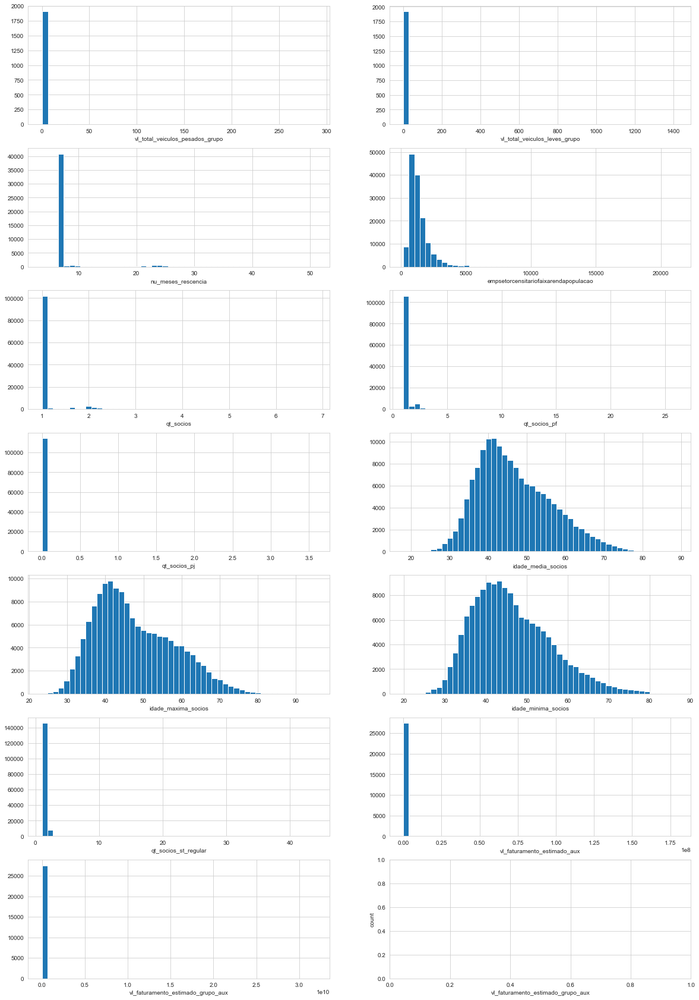


The next code block impute the missing values generated (they were created in sequence, so they'll match the missing values' positions), and creates yet another plot of all the float features without missing values - e.g. already imputed.


```python
for feature in float_features_with_missing:
    market_df_copy.loc[market_df_copy[feature].isna(), feature] = numeric_impute_dict[feature]["impute_variables"]
create_distplots(market_df_copy, float_features)
```


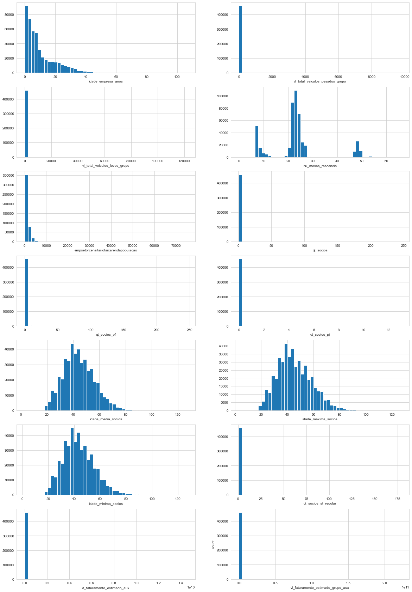


The float features distributions with imputed missing values are now behaving simmilarly to the original distributions. The table below shows that there are no missing values among the `float64` features.


```python
market_control_df = create_control_df(market_df_copy)
market_control_df.loc[float_features, :]
```


<div>
<style scoped>
    .dataframe tbody tr th:only-of-type {
        vertical-align: middle;
    }

    .dataframe tbody tr th {
        vertical-align: top;
    }

    .dataframe thead th {
        text-align: right;
    }
</style>
<table border="1" class="dataframe">
  <thead>
    <tr style="text-align: right;">
      <th></th>
      <th>missing</th>
      <th>missing_percentage</th>
      <th>type</th>
      <th>unique</th>
      <th>unique_percentage</th>
    </tr>
    <tr>
      <th>features</th>
      <th></th>
      <th></th>
      <th></th>
      <th></th>
      <th></th>
    </tr>
  </thead>
  <tbody>
    <tr>
      <th>idade_empresa_anos</th>
      <td>0</td>
      <td>0.0</td>
      <td>float64</td>
      <td>14198</td>
      <td>3.0712</td>
    </tr>
    <tr>
      <th>vl_total_veiculos_pesados_grupo</th>
      <td>0</td>
      <td>0.0</td>
      <td>float64</td>
      <td>367</td>
      <td>0.0794</td>
    </tr>
    <tr>
      <th>vl_total_veiculos_leves_grupo</th>
      <td>0</td>
      <td>0.0</td>
      <td>float64</td>
      <td>451</td>
      <td>0.0976</td>
    </tr>
    <tr>
      <th>nu_meses_rescencia</th>
      <td>0</td>
      <td>0.0</td>
      <td>float64</td>
      <td>1362</td>
      <td>0.2946</td>
    </tr>
    <tr>
      <th>empsetorcensitariofaixarendapopulacao</th>
      <td>0</td>
      <td>0.0</td>
      <td>float64</td>
      <td>128572</td>
      <td>27.8115</td>
    </tr>
    <tr>
      <th>qt_socios</th>
      <td>0</td>
      <td>0.0</td>
      <td>float64</td>
      <td>489</td>
      <td>0.1058</td>
    </tr>
    <tr>
      <th>qt_socios_pf</th>
      <td>0</td>
      <td>0.0</td>
      <td>float64</td>
      <td>567</td>
      <td>0.1226</td>
    </tr>
    <tr>
      <th>qt_socios_pj</th>
      <td>0</td>
      <td>0.0</td>
      <td>float64</td>
      <td>102</td>
      <td>0.0221</td>
    </tr>
    <tr>
      <th>idade_media_socios</th>
      <td>0</td>
      <td>0.0</td>
      <td>float64</td>
      <td>54658</td>
      <td>11.8231</td>
    </tr>
    <tr>
      <th>idade_maxima_socios</th>
      <td>0</td>
      <td>0.0</td>
      <td>float64</td>
      <td>19382</td>
      <td>4.1925</td>
    </tr>
    <tr>
      <th>idade_minima_socios</th>
      <td>0</td>
      <td>0.0</td>
      <td>float64</td>
      <td>20598</td>
      <td>4.4556</td>
    </tr>
    <tr>
      <th>qt_socios_st_regular</th>
      <td>0</td>
      <td>0.0</td>
      <td>float64</td>
      <td>591</td>
      <td>0.1278</td>
    </tr>
    <tr>
      <th>vl_faturamento_estimado_aux</th>
      <td>0</td>
      <td>0.0</td>
      <td>float64</td>
      <td>6527</td>
      <td>1.4119</td>
    </tr>
    <tr>
      <th>vl_faturamento_estimado_grupo_aux</th>
      <td>0</td>
      <td>0.0</td>
      <td>float64</td>
      <td>13452</td>
      <td>2.9098</td>
    </tr>
  </tbody>
</table>
</div>


#### <a name="missingcat">2.6.2 Missing Values of Categorical Features</a>
The following code blocks presents the remaining categorical features (of type object and bool), and their respective count and percentage of missing values.


```python
pd.concat([market_control_df.loc[object_features], market_df[object_features].describe().T[["count", "top", "freq"]]], axis=1).sort_values(by="missing", ascending=False)
```


<div>
<style scoped>
    .dataframe tbody tr th:only-of-type {
        vertical-align: middle;
    }

    .dataframe tbody tr th {
        vertical-align: top;
    }

    .dataframe thead th {
        text-align: right;
    }
</style>
<table border="1" class="dataframe">
  <thead>
    <tr style="text-align: right;">
      <th></th>
      <th>missing</th>
      <th>missing_percentage</th>
      <th>type</th>
      <th>unique</th>
      <th>unique_percentage</th>
      <th>count</th>
      <th>top</th>
      <th>freq</th>
    </tr>
    <tr>
      <th>features</th>
      <th></th>
      <th></th>
      <th></th>
      <th></th>
      <th></th>
      <th></th>
      <th></th>
      <th></th>
    </tr>
  </thead>
  <tbody>
    <tr>
      <th>nm_meso_regiao</th>
      <td>58698</td>
      <td>12.697</td>
      <td>object</td>
      <td>19</td>
      <td>0.0041</td>
      <td>403600</td>
      <td>CENTRO AMAZONENSE</td>
      <td>71469</td>
    </tr>
    <tr>
      <th>nm_micro_regiao</th>
      <td>58698</td>
      <td>12.697</td>
      <td>object</td>
      <td>73</td>
      <td>0.0158</td>
      <td>403600</td>
      <td>MANAUS</td>
      <td>60008</td>
    </tr>
    <tr>
      <th>de_faixa_faturamento_estimado</th>
      <td>27513</td>
      <td>5.951</td>
      <td>object</td>
      <td>12</td>
      <td>0.0026</td>
      <td>434785</td>
      <td>DE R$ 81.000,01 A R$ 360.000,00</td>
      <td>273861</td>
    </tr>
    <tr>
      <th>de_faixa_faturamento_estimado_grupo</th>
      <td>27513</td>
      <td>5.951</td>
      <td>object</td>
      <td>11</td>
      <td>0.0024</td>
      <td>434785</td>
      <td>DE R$ 81.000,01 A R$ 360.000,00</td>
      <td>252602</td>
    </tr>
    <tr>
      <th>de_saude_tributaria</th>
      <td>14851</td>
      <td>3.212</td>
      <td>object</td>
      <td>6</td>
      <td>0.0013</td>
      <td>447447</td>
      <td>VERDE</td>
      <td>145430</td>
    </tr>
    <tr>
      <th>de_saude_rescencia</th>
      <td>14851</td>
      <td>3.212</td>
      <td>object</td>
      <td>5</td>
      <td>0.0011</td>
      <td>447447</td>
      <td>ACIMA DE 1 ANO</td>
      <td>378896</td>
    </tr>
    <tr>
      <th>de_nivel_atividade</th>
      <td>11168</td>
      <td>2.416</td>
      <td>object</td>
      <td>4</td>
      <td>0.0009</td>
      <td>451130</td>
      <td>MEDIA</td>
      <td>217949</td>
    </tr>
    <tr>
      <th>sg_uf_matriz</th>
      <td>1939</td>
      <td>0.419</td>
      <td>object</td>
      <td>27</td>
      <td>0.0058</td>
      <td>460359</td>
      <td>MA</td>
      <td>124823</td>
    </tr>
    <tr>
      <th>setor</th>
      <td>1927</td>
      <td>0.417</td>
      <td>object</td>
      <td>5</td>
      <td>0.0011</td>
      <td>460371</td>
      <td>COMERCIO</td>
      <td>211224</td>
    </tr>
    <tr>
      <th>nm_divisao</th>
      <td>1927</td>
      <td>0.417</td>
      <td>object</td>
      <td>87</td>
      <td>0.0188</td>
      <td>460371</td>
      <td>COMERCIO VAREJISTA</td>
      <td>172404</td>
    </tr>
    <tr>
      <th>nm_segmento</th>
      <td>1927</td>
      <td>0.417</td>
      <td>object</td>
      <td>21</td>
      <td>0.0045</td>
      <td>460371</td>
      <td>COMERCIO; REPARACAO DE VEICULOS AUTOMOTORES E ...</td>
      <td>211224</td>
    </tr>
    <tr>
      <th>de_natureza_juridica</th>
      <td>0</td>
      <td>0.000</td>
      <td>object</td>
      <td>67</td>
      <td>0.0145</td>
      <td>462298</td>
      <td>EMPRESARIO INDIVIDUAL</td>
      <td>295756</td>
    </tr>
    <tr>
      <th>sg_uf</th>
      <td>0</td>
      <td>0.000</td>
      <td>object</td>
      <td>6</td>
      <td>0.0013</td>
      <td>462298</td>
      <td>MA</td>
      <td>127654</td>
    </tr>
    <tr>
      <th>natureza_juridica_macro</th>
      <td>0</td>
      <td>0.000</td>
      <td>object</td>
      <td>7</td>
      <td>0.0015</td>
      <td>462298</td>
      <td>OUTROS</td>
      <td>320211</td>
    </tr>
    <tr>
      <th>de_ramo</th>
      <td>0</td>
      <td>0.000</td>
      <td>object</td>
      <td>33</td>
      <td>0.0071</td>
      <td>462298</td>
      <td>COMERCIO VAREJISTA</td>
      <td>172404</td>
    </tr>
    <tr>
      <th>idade_emp_cat</th>
      <td>0</td>
      <td>0.000</td>
      <td>object</td>
      <td>6</td>
      <td>0.0013</td>
      <td>462298</td>
      <td>1 a 5</td>
      <td>138580</td>
    </tr>
  </tbody>
</table>
</div>


```python
market_control_df.loc[boolean_features].sort_values(by="missing", ascending=False)
```


<div>
<style scoped>
    .dataframe tbody tr th:only-of-type {
        vertical-align: middle;
    }

    .dataframe tbody tr th {
        vertical-align: top;
    }

    .dataframe thead th {
        text-align: right;
    }
</style>
<table border="1" class="dataframe">
  <thead>
    <tr style="text-align: right;">
      <th></th>
      <th>missing</th>
      <th>missing_percentage</th>
      <th>type</th>
      <th>unique</th>
      <th>unique_percentage</th>
    </tr>
    <tr>
      <th>features</th>
      <th></th>
      <th></th>
      <th></th>
      <th></th>
      <th></th>
    </tr>
  </thead>
  <tbody>
    <tr>
      <th>fl_optante_simples</th>
      <td>82713</td>
      <td>17.892</td>
      <td>float64</td>
      <td>2</td>
      <td>0.0004</td>
    </tr>
    <tr>
      <th>fl_optante_simei</th>
      <td>82713</td>
      <td>17.892</td>
      <td>float64</td>
      <td>2</td>
      <td>0.0004</td>
    </tr>
    <tr>
      <th>fl_spa</th>
      <td>1927</td>
      <td>0.417</td>
      <td>float64</td>
      <td>2</td>
      <td>0.0004</td>
    </tr>
    <tr>
      <th>fl_antt</th>
      <td>1927</td>
      <td>0.417</td>
      <td>float64</td>
      <td>2</td>
      <td>0.0004</td>
    </tr>
    <tr>
      <th>fl_veiculo</th>
      <td>1927</td>
      <td>0.417</td>
      <td>float64</td>
      <td>2</td>
      <td>0.0004</td>
    </tr>
    <tr>
      <th>fl_simples_irregular</th>
      <td>1927</td>
      <td>0.417</td>
      <td>float64</td>
      <td>2</td>
      <td>0.0004</td>
    </tr>
    <tr>
      <th>fl_passivel_iss</th>
      <td>1927</td>
      <td>0.417</td>
      <td>float64</td>
      <td>2</td>
      <td>0.0004</td>
    </tr>
    <tr>
      <th>fl_matriz</th>
      <td>0</td>
      <td>0.000</td>
      <td>float64</td>
      <td>2</td>
      <td>0.0004</td>
    </tr>
    <tr>
      <th>fl_me</th>
      <td>0</td>
      <td>0.000</td>
      <td>float64</td>
      <td>2</td>
      <td>0.0004</td>
    </tr>
    <tr>
      <th>fl_sa</th>
      <td>0</td>
      <td>0.000</td>
      <td>float64</td>
      <td>2</td>
      <td>0.0004</td>
    </tr>
    <tr>
      <th>fl_mei</th>
      <td>0</td>
      <td>0.000</td>
      <td>float64</td>
      <td>2</td>
      <td>0.0004</td>
    </tr>
    <tr>
      <th>fl_ltda</th>
      <td>0</td>
      <td>0.000</td>
      <td>float64</td>
      <td>2</td>
      <td>0.0004</td>
    </tr>
    <tr>
      <th>fl_st_especial</th>
      <td>0</td>
      <td>0.000</td>
      <td>float64</td>
      <td>2</td>
      <td>0.0004</td>
    </tr>
    <tr>
      <th>fl_email</th>
      <td>0</td>
      <td>0.000</td>
      <td>float64</td>
      <td>2</td>
      <td>0.0004</td>
    </tr>
    <tr>
      <th>fl_telefone</th>
      <td>0</td>
      <td>0.000</td>
      <td>float64</td>
      <td>2</td>
      <td>0.0004</td>
    </tr>
    <tr>
      <th>fl_rm</th>
      <td>0</td>
      <td>0.000</td>
      <td>float64</td>
      <td>2</td>
      <td>0.0004</td>
    </tr>
  </tbody>
</table>
</div>


Simmilarly to the imputation done to fhe numeric features, we'll use random forests to classify the missing values. As predictors, this time we'll use all the numeric features, in which values have been imputed, and the categorical features without missing values.


```python
categorical_features_with_missing = object_features_with_missing + boolean_features_with_missing
print(f"Categorical features with missing values:\n{categorical_features_with_missing}")
```

    Categorical features with missing values:
    ['setor', 'nm_divisao', 'nm_segmento', 'sg_uf_matriz', 'de_saude_tributaria', 'de_saude_rescencia', 'de_nivel_atividade', 'nm_meso_regiao', 'nm_micro_regiao', 'de_faixa_faturamento_estimado', 'de_faixa_faturamento_estimado_grupo', 'fl_spa', 'fl_antt', 'fl_veiculo', 'fl_optante_simples', 'fl_optante_simei', 'fl_simples_irregular', 'fl_passivel_iss']
    


```python
%%time
categorical_impute_dict = impute_value_generator(df=market_df_copy,
                                                 targets=categorical_features_with_missing,
                                                 numeric_predictors=numeric_features,
                                                 categorical_predictors=categorical_features_without_missing,
                                                 target_type='categorical',
                                                 sample_size=50000)
```

    Executing iteration for setor
    Metrics:
    accuracy: 0.99
    Weighted F1 score: 0.99
    -------------------------------------------------------------------------------------------------------------------------------------------------------------------------
    Executing iteration for nm_divisao
    Metrics:
    accuracy: 0.87
    Weighted F1 score: 0.89
    -------------------------------------------------------------------------------------------------------------------------------------------------------------------------
    Executing iteration for nm_segmento
    Metrics:
    accuracy: 1.0
    Weighted F1 score: 1.0
    -------------------------------------------------------------------------------------------------------------------------------------------------------------------------
    Executing iteration for sg_uf_matriz
    Metrics:
    accuracy: 0.99
    Weighted F1 score: 0.99
    -------------------------------------------------------------------------------------------------------------------------------------------------------------------------
    Executing iteration for de_saude_tributaria
    Metrics:
    accuracy: 0.64
    Weighted F1 score: 0.64
    -------------------------------------------------------------------------------------------------------------------------------------------------------------------------
    Executing iteration for de_saude_rescencia
    Metrics:
    accuracy: 1.0
    Weighted F1 score: 1.0
    -------------------------------------------------------------------------------------------------------------------------------------------------------------------------
    Executing iteration for de_nivel_atividade
    Metrics:
    accuracy: 0.73
    Weighted F1 score: 0.74
    -------------------------------------------------------------------------------------------------------------------------------------------------------------------------
    Executing iteration for nm_meso_regiao
    Metrics:
    accuracy: 0.69
    Weighted F1 score: 0.71
    -------------------------------------------------------------------------------------------------------------------------------------------------------------------------
    Executing iteration for nm_micro_regiao
    Metrics:
    accuracy: 0.56
    Weighted F1 score: 0.6
    -------------------------------------------------------------------------------------------------------------------------------------------------------------------------
    Executing iteration for de_faixa_faturamento_estimado
    Metrics:
    accuracy: 0.99
    Weighted F1 score: 0.99
    -------------------------------------------------------------------------------------------------------------------------------------------------------------------------
    Executing iteration for de_faixa_faturamento_estimado_grupo
    Metrics:
    accuracy: 0.99
    Weighted F1 score: 0.99
    -------------------------------------------------------------------------------------------------------------------------------------------------------------------------
    Executing iteration for fl_spa
    Metrics:
    accuracy: 1.0
    Weighted F1 score: 1.0
    -------------------------------------------------------------------------------------------------------------------------------------------------------------------------
    Executing iteration for fl_antt
    Metrics:
    accuracy: 0.99
    Weighted F1 score: 1.0
    -------------------------------------------------------------------------------------------------------------------------------------------------------------------------
    Executing iteration for fl_veiculo
    Metrics:
    accuracy: 0.99
    Weighted F1 score: 0.99
    -------------------------------------------------------------------------------------------------------------------------------------------------------------------------
    Executing iteration for fl_optante_simples
    Metrics:
    accuracy: 0.81
    Weighted F1 score: 0.81
    -------------------------------------------------------------------------------------------------------------------------------------------------------------------------
    Executing iteration for fl_optante_simei
    Metrics:
    accuracy: 1.0
    Weighted F1 score: 1.0
    -------------------------------------------------------------------------------------------------------------------------------------------------------------------------
    Executing iteration for fl_simples_irregular
    Metrics:
    accuracy: 1.0
    Weighted F1 score: 1.0
    -------------------------------------------------------------------------------------------------------------------------------------------------------------------------
    Executing iteration for fl_passivel_iss
    Metrics:
    accuracy: 0.88
    Weighted F1 score: 0.88
    -------------------------------------------------------------------------------------------------------------------------------------------------------------------------
    Wall time: 2min 42s
    

Next, the categorical features with missing values are imputed and countplots are generated.


```python
for feature in categorical_features_with_missing:
    # Re-transforming the predicted classes from numbers to labels.
    _to_impute = categorical_impute_dict[feature]["label_encoder"].inverse_transform(categorical_impute_dict[feature]["impute_variables"])
    market_df_copy.loc[market_df_copy[feature].isna(), feature] = _to_impute
create_barplots(market_df_copy, object_features, n_labels=10)
```


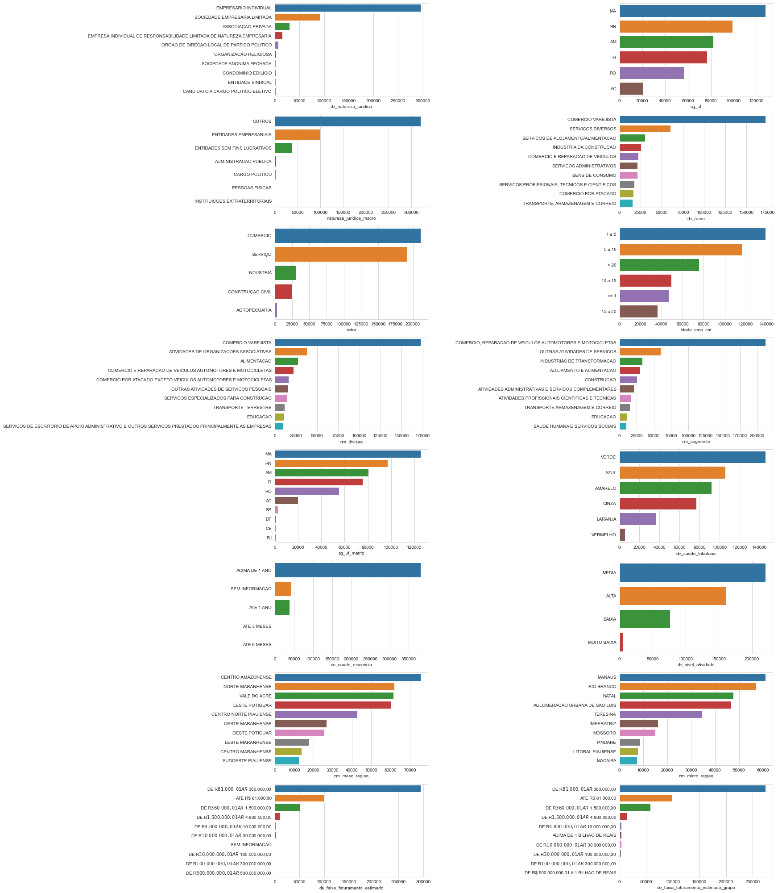


The result printed next shows that there are no more missing values in our dataset.


```python
print(f"The percentage of missing values in the market dataset is {round(100*(market_df_copy.isna().sum().sum() / market_df_copy.size))} %")
```

    The percentage of missing values in the market dataset is 0 %
    

### <a name="featuresel">2.7 Feature Selection</a>
In the next step we try to reduce our feature space by using a feature selection technique that can deal with sparse matrices.


```python
def truncated_SVD_selector(df, numeric_features, categorical_features, n_components=250, evr=None):
    """
    Feature selection by the use of truncatedSVD.
    :param df: Pandas DataFrame with the data for the feature selection to be applied.
    :param numeric_features: list, must contain names of the numeric features in the dataset.
    :param categorical_features: list, must contain names of the categorical features in the dataset.
    :param n_components: integer, number of principal components.
    :return: array containing the number of features defined with n_components and the pipeline used to process the features.
    """    
    
    # Sciki-learn pipeline and column transformer
    cat_pipeline = Pipeline(steps=[
        ("onehot", OneHotEncoder(drop="first", dtype=np.int32))
    ])

    num_pipeline = Pipeline(steps=[
        ("scaler", Normalizer())
    ])
    
    transformer = ColumnTransformer(transformers=[
        ("categorical", cat_pipeline, categorical_features),
        ("numeric", num_pipeline, numeric_features)
    ])
    
    pipeline = Pipeline(steps=[
        ("transformer", transformer),
        ("feature_selection", TruncatedSVD(n_components=n_components, algorithm="arpack", random_state=0))
    ])   
    
    processed_df = pipeline.fit_transform(df)
    
    if not evr:
        return processed_df, pipeline
    
    else:
        explained_variance_ratio = np.cumsum(pipeline.get_params()["feature_selection"].explained_variance_ratio_)
        n_PCs = explained_variance_ratio[(explained_variance_ratio <= evr)].argmax()
        return processed_df[:, 0:n_PCs], pipeline        
    

def evr_plot(pipeline):
    """
    Plot cumulative explained variance ratio for the feature selection algorithm used in the pipeline. To be used in conjunction with the output pipeline of\n
the function "truncated_SVD_selector".
    :param pipeline: output of the function "truncated_SVD_selector", scikit-learn pipeline with a step called "feature_selection", which contains the\n
feature selection algorithm.
    """
    explained_variance_ratio = pipeline.get_params()["feature_selection"].explained_variance_ratio_
    g = sns.lineplot(np.arange(len(explained_variance_ratio)), np.cumsum(explained_variance_ratio))
    g.axes.axhline(0.995, ls="--", color="red")
    plt.xlabel('Number of components')
    plt.ylabel('Cumulative explained variance');  
```


```python
%%time
array_df_final, feature_selection_pipeline = truncated_SVD_selector(df=market_df_copy,
                                                                    numeric_features=numeric_features,
                                                                    categorical_features=categorical_features,
                                                                    n_components=250,
                                                                    evr=0.995)
```

    Wall time: 26.5 s
    

It's possible to see through the plot below the approximate number of components to obtain 99.5% explained variance ratio - observe that the function encodes categorical features with one hot encoder thus the feature space is way bigger (contains around 430 features, as denoted below) than the previously treated dataframe, which contained 47 features.  
The feature selection function is called with the paramater evr set to 0.995 so that the resulting matrix has the number of components required to match this percentage of explained variance.


```python
market_control_df = create_control_df(market_df_copy)
unique_classes = market_control_df.loc[categorical_features, "unique"].sum()
estimated_max_components = unique_classes + len(numeric_features)
print(f"Dimension of the dataframe without missing values: {market_df_copy.shape}")
print(f"The estimated max number of components is {estimated_max_components}")
print(f"Dimension of the processed market dataset: {array_df_final.shape}")
```

    Dimension of the dataframe without missing values: (462298, 47)
    The estimated max number of components is 436
    Dimension of the processed market dataset: (462298, 190)
    


```python
evr_plot(feature_selection_pipeline)
```


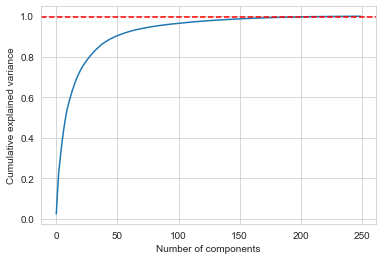


___  

[go back to top](#top)  

___  

## <a name="overview">3 Algorithm Evaluation and Overview of Steps to be Taken</a>

### <a name="typesrecsys">3.1 Types of Recommender Systems</a>

A type of algorithm known as Recommender System is the first thing that comes to mind considering the problem at hand: to provide an automated service that recommends new business leads to a user given his current clients portfolio. There's many different approaches to create a Recommender System, which depend on the original data format and size.  
The main approaches are:  

* [Simple Recommenders / Popularity Based System](https://www.datacamp.com/community/tutorials/recommender-systems-python): In popularity based recommender systems, the "knowledge of the masses" is used to make recommendations based on, you guessed, what most people like. There is a nice example in the link.

* [Collaborative Filtering](https://en.wikipedia.org/wiki/Collaborative_filtering): In collaborative filtering, the interests of many users (hence collaborative) are used to filter the data and predict the tastes of a certain user. The main idea is that a user gets better recommendations from people that have similar preferences. Usually, it is required that the data presents a user database, and item database, and a way to infer user preferences regarding the items, which may be explicit, like ratings given by each user to the respective item, or it may be some sort of implicit rating as well, like clicks on a type of add. Commonly, the system may be constructed by looking for users that rate items simmilarly, or look for simmilarities between items.  

* [Content Based Fitering](http://recommender-systems.org/content-based-filtering/): In content based filtering, the idea is to compare items based on their features/contents, and then recommend similar items to the ones a user has interacted in the past (like with the profiles at hand). There are several learning techniques to learn a user profile. 

* [Hybrid Methods](https://en.wikipedia.org/wiki/Recommender_system#Hybrid_recommender_systems): As the name says, this approach combines different techinques, as in content based filtering, collaborative filtering, etc., to create recommendations based not only on user ratings, but also in items features and characteristics.

### <a name="approach">3.2 Selected Approach and Steps</a>

That said, after experimentation, research and input from felow students and the community, **For this project, a Content Based Filtering Recommender System based in *Logistic Regression* is going to be used**. It's not quite a recommender system per se ([at least not like the ones I found](#refs)), e.g. it does not uses technologies as TF-IDF, Matrix Factorization, similarity comparison through euclidean/cosine distances, but it does recommend leads!  
The steps taken, overall, are:  
* The companies that are already clients can be used as targets provided they're encoded as 0s and 1s, or False and True.  
* The processed database can be used as predictors.  
* We aim not to obtain the classifications per se, but the logistic regression predicted probability that the company is indeed a client. With this, we can sort the recommended companies based on the predicted probability that they're clients.  
* Since there's almost 470E3 companies, we'll use KMeans clustering to group the companies and train logistic regressions for each group.  
* The data is very imbalanced - each portfolio has around 500 companies, and we've just cited the size of the dataframe with all companies. We'll use SMOTE oversampling along the training sets to address this issue.  
* Metrics will be calculated for the trained logistic regression and recommendations made using portfolio 2.
* The recommendations made will be evaluated through the MAP@k metric.  

It can be argued that it's a matter of adapting the dataset so that we obtain the required format required by each approach. That said, to the problem and dataset at hand:

* Three portfolios are presented - our user base is of three, and usually to use collaborative filtering many users would be needed (creating simulated profiles could be an idea here).

* These portfolios do not present user ratings (not explicitly, at least) on each of the "items", which are the clients.

* As seen in the previous exploratory data analysis section, each client presents several features that may be used to identify similar observations/clients.  

___  

[go back to top](#top)  

___  

## <a name="training">4 Model Training</a>  

### <a name="portfoliodata">4.1 Load Portfolio Data</a>  


```python
portfolio1 = pd.read_csv('../data/estaticos_portfolio1.csv', usecols=["id"])
portfolio2 = pd.read_csv('../data/estaticos_portfolio2.csv', usecols=["id"])
portfolio3 = pd.read_csv('../data/estaticos_portfolio3.csv', usecols=["id"])
```

Checking if the clients ID's from the portfolios are in the main database.


```python
def check_portfolio_info(database, portfolio):
    """
    Check if the database contains the portfolios' IDs.
    The portfolio and database must contain `id` as a feature.
    :param database: Pandas DataFrame, contains all the companies' IDs as feature `id`.
    :param portfolio: Pandas DataFrame, contains only the portfolio clients' IDs as feature `id`.
    """
    print(f"Database size: {database.shape[0]}")
    print(f"Portfolio size: {portfolio.shape[0]}")

    # Test - check if database contains portfolios' IDs
    assert np.all(portfolio["id"].isin(database["id"])), "Test 1: NOT OK - Not all the portfolios' ids are in the database"
    print("Test: OK - All the portfolios' ids are in the database\n")
    print(169*"-")
```


```python
for portfolio, number in zip([portfolio1, portfolio2, portfolio3], range(1,4)):
    print(f"\nTesting Portfolio {number}\n")
    check_portfolio_info(IDs, portfolio)
```

    
    Testing Portfolio 1
    
    Database size: 462298
    Portfolio size: 555
    Test: OK - All the portfolios' ids are in the database
    
    -------------------------------------------------------------------------------------------------------------------------------------------------------------------------
    
    Testing Portfolio 2
    
    Database size: 462298
    Portfolio size: 566
    Test: OK - All the portfolios' ids are in the database
    
    -------------------------------------------------------------------------------------------------------------------------------------------------------------------------
    
    Testing Portfolio 3
    
    Database size: 462298
    Portfolio size: 265
    Test: OK - All the portfolios' ids are in the database
    
    -------------------------------------------------------------------------------------------------------------------------------------------------------------------------
    

### <a name="pc">4.2 "Companies Profile" Table / Principal Components DataFrame</a>

Below, we're getting all companies IDs and principal components in a dataframe.


```python
columns_names = []
for PC in range(1, array_df_final.shape[1]+1):
    columns_names.append("PC_" + str(PC))
companies_profile = pd.DataFrame(array_df_final, columns=columns_names, index=IDs["id"])

print(f"Dimension of companies profile table: {companies_profile.shape}")
```

    Dimension of companies profile table: (462298, 190)
    


```python
companies_profile.head()
```


<div>
<style scoped>
    .dataframe tbody tr th:only-of-type {
        vertical-align: middle;
    }

    .dataframe tbody tr th {
        vertical-align: top;
    }

    .dataframe thead th {
        text-align: right;
    }
</style>
<table border="1" class="dataframe">
  <thead>
    <tr style="text-align: right;">
      <th></th>
      <th>PC_1</th>
      <th>PC_2</th>
      <th>PC_3</th>
      <th>PC_4</th>
      <th>PC_5</th>
      <th>PC_6</th>
      <th>PC_7</th>
      <th>PC_8</th>
      <th>PC_9</th>
      <th>PC_10</th>
      <th>...</th>
      <th>PC_181</th>
      <th>PC_182</th>
      <th>PC_183</th>
      <th>PC_184</th>
      <th>PC_185</th>
      <th>PC_186</th>
      <th>PC_187</th>
      <th>PC_188</th>
      <th>PC_189</th>
      <th>PC_190</th>
    </tr>
    <tr>
      <th>id</th>
      <th></th>
      <th></th>
      <th></th>
      <th></th>
      <th></th>
      <th></th>
      <th></th>
      <th></th>
      <th></th>
      <th></th>
      <th></th>
      <th></th>
      <th></th>
      <th></th>
      <th></th>
      <th></th>
      <th></th>
      <th></th>
      <th></th>
      <th></th>
      <th></th>
    </tr>
  </thead>
  <tbody>
    <tr>
      <th>a6984c3ae395090e3bee8ad63c3758b110de096d5d819583a784a113726db849</th>
      <td>2.292665</td>
      <td>0.967004</td>
      <td>0.524173</td>
      <td>1.784401</td>
      <td>1.242783</td>
      <td>-1.239186</td>
      <td>-0.735621</td>
      <td>-0.439312</td>
      <td>0.672232</td>
      <td>-0.426301</td>
      <td>...</td>
      <td>-0.001614</td>
      <td>0.006139</td>
      <td>0.002382</td>
      <td>-0.000965</td>
      <td>-0.000749</td>
      <td>0.004624</td>
      <td>0.000812</td>
      <td>-0.001456</td>
      <td>-0.001636</td>
      <td>-0.000758</td>
    </tr>
    <tr>
      <th>6178f41ade1365e44bc2c46654c2c8c0eaae27dcb476c47fdef50b33f4f56f05</th>
      <td>3.336731</td>
      <td>1.045422</td>
      <td>0.566630</td>
      <td>-0.524458</td>
      <td>-1.266166</td>
      <td>-0.367399</td>
      <td>0.289703</td>
      <td>0.850979</td>
      <td>1.898394</td>
      <td>0.024087</td>
      <td>...</td>
      <td>0.001079</td>
      <td>-0.000793</td>
      <td>0.002951</td>
      <td>0.001739</td>
      <td>-0.001068</td>
      <td>0.001770</td>
      <td>-0.000971</td>
      <td>0.001262</td>
      <td>-0.000861</td>
      <td>0.001222</td>
    </tr>
    <tr>
      <th>4a7e5069a397f12fdd7fd57111d6dc5d3ba558958efc02edc5147bc2a2535b08</th>
      <td>3.108096</td>
      <td>0.390482</td>
      <td>1.935537</td>
      <td>0.698707</td>
      <td>-0.489345</td>
      <td>1.753825</td>
      <td>0.001656</td>
      <td>0.009493</td>
      <td>-0.459895</td>
      <td>-0.445723</td>
      <td>...</td>
      <td>0.004685</td>
      <td>-0.007768</td>
      <td>-0.000862</td>
      <td>-0.004139</td>
      <td>0.000505</td>
      <td>-0.005168</td>
      <td>0.003042</td>
      <td>0.003073</td>
      <td>0.002088</td>
      <td>0.001613</td>
    </tr>
    <tr>
      <th>3348900fe63216a439d2e5238c79ddd46ede454df7b9d8c24ac33eb21d4b21ef</th>
      <td>3.385046</td>
      <td>1.455910</td>
      <td>0.207190</td>
      <td>0.563407</td>
      <td>-1.110875</td>
      <td>1.221657</td>
      <td>-0.056992</td>
      <td>0.037638</td>
      <td>-0.613693</td>
      <td>0.259963</td>
      <td>...</td>
      <td>0.000043</td>
      <td>0.001319</td>
      <td>-0.003288</td>
      <td>0.000750</td>
      <td>0.000983</td>
      <td>-0.005605</td>
      <td>-0.006377</td>
      <td>0.002499</td>
      <td>-0.000603</td>
      <td>0.000628</td>
    </tr>
    <tr>
      <th>1f9bcabc9d3173c1fe769899e4fac14b053037b953a1e4b102c769f7611ab29f</th>
      <td>3.179317</td>
      <td>1.101441</td>
      <td>0.609660</td>
      <td>0.723841</td>
      <td>-0.437394</td>
      <td>-1.381790</td>
      <td>-0.780493</td>
      <td>0.073937</td>
      <td>-0.232520</td>
      <td>-0.133044</td>
      <td>...</td>
      <td>-0.002587</td>
      <td>0.003825</td>
      <td>0.004799</td>
      <td>-0.001196</td>
      <td>-0.001686</td>
      <td>-0.005309</td>
      <td>0.000535</td>
      <td>-0.000913</td>
      <td>0.002159</td>
      <td>0.003171</td>
    </tr>
  </tbody>
</table>
<p>5 rows × 190 columns</p>
</div>


We'll save the companies profile table with the principal components in a .zip file to use it later in the webapp. We're using float as "float16", which implies loosing some information, but it is needed so that the webapp can be deployed later.


```python
# %%time
# split_size = 8
# for idx, df_i in enumerate(np.array_split(companies_profile, split_size)):
#     df_i.to_csv(path_or_buf=f"../output/companies_profile_{idx}.bz2", float_format=np.float16, compression="bz2")
```

    Wall time: 1min 20s
    

### <a name="cluster">4.3 Clustering Companies with MiniBatchKMeans</a>

Next, we're clustering the companies based on their features to reduce the number of companies we use to train the model upon each iteration and improve classifications. We set a minimum limit to the reduction in heterogeneity for increases in the number of clusters.  
The KMeans algorithm divides the companies (see companies_profile above) in three clusters.


```python
def find_cluster(df, n_features=1, sse_limit=0.05, flag_start=2):
    """
    Use MiniBatchKMeans to find clusters in the dataset. It compares two groupings at each iterations, if\
 reduction in heterogeneity is inferior to threshold, return fitted algorithm.
    :param df: Pandas DataFrame to find clusters on.
    :param n_features: integer, number of features to be used from the dataframe.
    :param sse_limit: float, limit to the reduction in heterogeneity
    :param flag_start: integer, minimum number of clusters to start the comparisons.
    :return: fitted MiniBatchKMeans object and pandas series with cluster labels.
    """
    #build two kmeans models starting with 2 and 3 clusters and repeat until dss < sse_limit  
    flag = flag_start
    kmeans1 = MiniBatchKMeans(n_clusters=flag, random_state=0)
    
    if n_features == 1:
        kmeans1.fit(df.iloc[:, 0].values.reshape(-1, 1))
    else:
        kmeans1.fit(df.iloc[:, 0:n_features].values)
        
    while True:
        flag += 1
        kmeans2 = MiniBatchKMeans(n_clusters=flag, random_state=0)
        if n_features == 1:
            kmeans2.fit(df.iloc[:, 0].values.reshape(-1, 1))  
        else:
            kmeans2.fit(df.iloc[:, 0:n_features].values) 
    
        #decision criterion - additional cluster should reduce heterogeneity to not less than sse_limit
        dss = (kmeans1.inertia_ - kmeans2.inertia_)/kmeans1.inertia_
        print(f"From {flag-1} to {flag} clusters -> Reduction in heterogeneity: {dss}")
        if dss < sse_limit:
            break
        kmeans1 = kmeans2
    return kmeans1, pd.Series(kmeans1.labels_, name="cluster")
```


```python
%%time
kmeans, cluster_labels = find_cluster(companies_profile, n_features=5, sse_limit=0.2, flag_start=1) # fitted kmeans and cluster labels, turn to pd.Series
```

    From 1 to 2 clusters -> Reduction in heterogeneity: 0.2980609344696506
    From 2 to 3 clusters -> Reduction in heterogeneity: 0.259998847972185
    From 3 to 4 clusters -> Reduction in heterogeneity: 0.1581394378991338
    Wall time: 52.6 s
    Parser   : 393 ms
    

We'll save the cluster labels vector in a .zip file to use it later in the webapp.


```python
%%time
compression_opts = dict(method="zip", archive_name="cluster_labels.csv")
cluster_labels.to_csv(path_or_buf="../output/cluster_labels.zip", compression=compression_opts)
```

    Wall time: 4.28 s
    Parser   : 442 ms
    

### <a name="importantfunctions">4.4 Functions to Create Rating table and to Train Logistic Regression by Cluster</a>

Now, some functions are defined and used to train the model by cluster:
* `create_rating_df` maps the clients in a portfolio to the companies_profile and to a defined cluster.
* `train_classifiers` for each cluster and based on the portfolios' clients and the companies_profile - applies train_test_split, SMOTE oversampling, trains logistic regression, makes predictions and saves the trained model along with metrics. 


```python
def create_rating_df(portfolio, companies_profile, cluster_labels):
    """
    Create rating dataframe - a dataframe with columns:
    - id: the id of the company
    - client: if the company is a client (present) on the porfolio
    - cluster: to which cluster the company belongs
    :param portfolio: pandas dataframe with column "id", portfolio with client companies ids.
    :param companies_profile: pandas dataframe with all companies ids as index and companies features.
    :param cluster_labels: pandas series, has cluster labels obtained through KMeans.
    :return: pandas dataframe with columns cited above.
    """
    rating_df = companies_profile.reset_index()["id"] # get all IDs
    portfolio_flag = rating_df.isin(portfolio["id"]) # True means it is a client
    portfolio_flag.name = "client"
    rating_df = pd.concat([rating_df, portfolio_flag, cluster_labels], axis=1) # concatenate IDs, client flag and cluster labels
    return rating_df
```


```python
create_rating_df(portfolio=portfolio2, companies_profile=companies_profile, cluster_labels=cluster_labels).head()
```


<div>
<style scoped>
    .dataframe tbody tr th:only-of-type {
        vertical-align: middle;
    }

    .dataframe tbody tr th {
        vertical-align: top;
    }

    .dataframe thead th {
        text-align: right;
    }
</style>
<table border="1" class="dataframe">
  <thead>
    <tr style="text-align: right;">
      <th></th>
      <th>id</th>
      <th>client</th>
      <th>cluster</th>
    </tr>
  </thead>
  <tbody>
    <tr>
      <th>0</th>
      <td>a6984c3ae395090e3bee8ad63c3758b110de096d5d8195...</td>
      <td>False</td>
      <td>1</td>
    </tr>
    <tr>
      <th>1</th>
      <td>6178f41ade1365e44bc2c46654c2c8c0eaae27dcb476c4...</td>
      <td>False</td>
      <td>1</td>
    </tr>
    <tr>
      <th>2</th>
      <td>4a7e5069a397f12fdd7fd57111d6dc5d3ba558958efc02...</td>
      <td>False</td>
      <td>0</td>
    </tr>
    <tr>
      <th>3</th>
      <td>3348900fe63216a439d2e5238c79ddd46ede454df7b9d8...</td>
      <td>False</td>
      <td>1</td>
    </tr>
    <tr>
      <th>4</th>
      <td>1f9bcabc9d3173c1fe769899e4fac14b053037b953a1e4...</td>
      <td>False</td>
      <td>1</td>
    </tr>
  </tbody>
</table>
</div>


```python
def get_cluster_target_df(rating_df, cluster, companies_profile):
    """
    Returns a pandas dataframe with all companies present in the cluster and a pandas series that represents if the company is a client.
    :param rating_df: pandas dataframe, output of function create_rating_df contains the columns id, client and cluster.
    :param cluster: integer, cluster from which dataframe will be constructed.
    :param companies_profile: pandas dataframe with all companies ids as index and companies features.
    :return: pos 0, pandas dataframe with all companies present in the cluster. pos 1, pandas series that represents if the company is a client.
    """
    condition = rating_df["cluster"] == cluster # means that we're accessing the right cluster        
    cluster_ids = rating_df[(condition)]["id"] # gets ids from all companies in the cluster
    cluster_df = companies_profile.loc[cluster_ids, :] # get features from all companies in the cluster
    target = rating_df.loc[condition, "client"] # get target for cluster - True means it is a client
    return cluster_df, target
```


```python
def train_classifiers(portfolio, companies_profile, cluster_labels):
    """
    Train logistic regression classifier for each cluster present in the companies dataframe.\
    Predictor is a dataframe with all companies features' for each cluster, target is Pandas Series with boolean values indicating if company is client.
    Does train test split, SMOTE oversampling, logistic regression training for each cluster.
    :param portfolio: pandas dataframe with column "id", portfolio with client companies ids.
    :param companies_profile: pandas dataframe with all companies ids as index and companies features.
    :param cluster_labels: pandas series, has cluster labels obtained through KMeans.
    :return: dictionary, contains keys:
            -"client_flag": 1 if cluster has no clients, 0 if has. The following keys are present in the second case.
            -"classifier": trained logistic regression object.
            -"metrics": dictionary, contains keys:
                -"accuracy": accuracy score
                -"precision": precision score
                -"recall": recall score
                -"f1_score": f1 score
                -"roc_auc": area under the curve
    """
    rating_df = create_rating_df(portfolio=portfolio, companies_profile=companies_profile, cluster_labels=cluster_labels)
    
    n_clusters = cluster_labels.nunique()
    
    _train_output = {}
    
    for cluster in range(n_clusters):
    
        print(f"- Veryfing Cluster {cluster} -\n")
        cluster_df, y = get_cluster_target_df(rating_df, cluster, companies_profile)

        print(f"Cluster size: {cluster_df.shape[0]}\nClients in cluster: {y.sum()}\nClients per cluster ratio: {round(100*(y.sum()/cluster_df.shape[0]), 3)} % \n")
        
        print("Processing:\n")

        if y.sum() != 0:
            client_flag = 0
            print("Applying train test split . . .")
            X_train, X_test, y_train, y_test = train_test_split(cluster_df, y, test_size=0.3, stratify=y, random_state=0)
            print("Applying SMOTE oversampling . . .")
            X_train, y_train = SMOTE(random_state=0, n_jobs=-1).fit_resample(X_train, y_train)
            print("Training Logistic Regression . . .")
            classifier = LogisticRegression(solver="saga", max_iter=1000, random_state=0, n_jobs=-1, class_weight="balanced")
            classifier.fit(X_train, y_train)
            print("Making predictions and saving metrics . . .")
            prediction = classifier.predict(X_test)
            _train_output.update({cluster: {"client_flag": client_flag,
                                            "classifier": classifier,
                                            "metrics": {"accuracy": accuracy_score(y_test, prediction),
                                                        "precision": precision_score(y_test, prediction),
                                                        "recall": recall_score(y_test, prediction),
                                                        "f1_score": f1_score(y_test, prediction),
                                                        "roc_auc": roc_auc_score(y_test, prediction)}
                                            }
                                  })
        else:
            print("Cluster has no clients, saving {'client_flag': 1} in the output dictionary.")
            client_flag = 1
            _train_output.update({cluster: {"client_flag": client_flag}})

        print(169*"-"+"\n")

    return _train_output
```

### <a name="lrtraining">4.5 Logistic Regression Training</a>

The logistic regression will be trained and evaluated for **Portfolio 2**.


```python
%%time
train_output = train_classifiers(portfolio=portfolio2, companies_profile=companies_profile, cluster_labels=cluster_labels)
```

    - Veryfing Cluster 0 -
    
    Cluster size: 97296
    Clients in cluster: 0
    Clients per cluster ratio: 0.0 % 
    
    Processing:
    
    Cluster has no clients, saving {'client_flag': 1} in the output dictionary.
    -------------------------------------------------------------------------------------------------------------------------------------------------------------------------
    
    - Veryfing Cluster 1 -
    
    Cluster size: 201620
    Clients in cluster: 478
    Clients per cluster ratio: 0.237 % 
    
    Processing:
    
    Applying train test split . . .
    Applying SMOTE oversampling . . .
    Training Logistic Regression . . .
    Making predictions and saving metrics . . .
    -------------------------------------------------------------------------------------------------------------------------------------------------------------------------
    
    - Veryfing Cluster 2 -
    
    Cluster size: 163382
    Clients in cluster: 88
    Clients per cluster ratio: 0.054 % 
    
    Processing:
    
    Applying train test split . . .
    Applying SMOTE oversampling . . .
    Training Logistic Regression . . .
    Making predictions and saving metrics . . .
    -------------------------------------------------------------------------------------------------------------------------------------------------------------------------
    
    Wall time: 4min 21s
    

___  

[go back to top](#top)  

___  

## <a name="performance">5 Model Performance</a>  

### <a name="lrmetrics">5.1 Logistic Regression Metrics</a>  

Let us analyse the metrics for the logistic regression classification in each cluster.


```python
metrics_df = pd.DataFrame()
for cluster in train_output.keys():
    if train_output[cluster]["client_flag"] == 0:
        temp_metric = pd.Series(train_output[cluster]["metrics"], name="cluster_"+str(cluster))
        metrics_df = pd.concat([metrics_df, temp_metric], axis=1)
metrics_df.to_csv(path_or_buf="../output/lr_metrics.csv")
```


```python
metrics_df
```


<div>
<style scoped>
    .dataframe tbody tr th:only-of-type {
        vertical-align: middle;
    }

    .dataframe tbody tr th {
        vertical-align: top;
    }

    .dataframe thead th {
        text-align: right;
    }
</style>
<table border="1" class="dataframe">
  <thead>
    <tr style="text-align: right;">
      <th></th>
      <th>cluster_1</th>
      <th>cluster_2</th>
    </tr>
  </thead>
  <tbody>
    <tr>
      <th>accuracy</th>
      <td>0.996512</td>
      <td>0.999143</td>
    </tr>
    <tr>
      <th>precision</th>
      <td>0.403409</td>
      <td>0.375000</td>
    </tr>
    <tr>
      <th>recall</th>
      <td>0.993007</td>
      <td>0.923077</td>
    </tr>
    <tr>
      <th>f1_score</th>
      <td>0.573737</td>
      <td>0.533333</td>
    </tr>
    <tr>
      <th>roc_auc</th>
      <td>0.994763</td>
      <td>0.961130</td>
    </tr>
  </tbody>
</table>
</div>


We've seen in the output of the training (section 4.5 above) that the ratio of clients in each cluster was very low, that's why we used SMOTE to address the issue of imbalanced classes. That said:
* Both models present high accuracy scores.
* The **high recall** infers that **the model has been able to detect almost all clients in the test dataset**.
* **This came at the cost of precision**, but since we're trying to recommend new leads, it shouldn't be a big a problem to have many false positives.
    * That, and the idea of using Logistic Regression is to get the "estimated probability" that the observation belongs to the class 1, or, that the company is a client. We do not need to define a new threshold to improve precision for that.
* As expected, with this low precision, the F1 score is also low.
* The ROC AUC score presents high values, it is a good indicator to compare these models to other eventually trained classification models.

### <a name="importantfunctions2">5.2 Functions to Make Recommendations</a>
Next, the functions `recommend` and `train_recommend` are defined.  
* `recommend` makes "total_recs" recommendations from the porfolio. The number of recommendations made from each cluster depends on the proportion of clients that are in the cluster. Say, if the cluster 1 had 8 clients, and the cluster 2 had 2, and we asked for 10 recommendations, 8 would be from cluster 1, and 2 from cluster 2.  
* `train_recommend` trains the logistic regression model by calling the `train_classifiers` function, and with it's ouptut calls the function `recommend`.


```python
def recommend(portfolio, companies_profile, cluster_labels, train_output, total_recs=10, remove_portfolio_ids=False):
    """
    Makes "total_recs" recommendations. Recommendations are made for each cluster proportional to the number of clients in them. \
    Recommendations are sorted in descending order by their predicted probabilities.
    :param portfolio: pandas dataframe with column "id", portfolio with client companies ids.
    :param companies_profile: pandas dataframe with all companies ids as index and companies features.
    :param cluster_labels: pandas series, has cluster labels obtained through KMeans.
    :param train_ouput: dictionary, contains keys:
            -"client_flag": 1 if cluster has no clients, 0 if has. The following keys are present in the second case.
            -"classifier": trained logistic regression object.
            -"metrics": dictionary, contains keys:
                -"accuracy": accuracy score
                -"precision": precision score
                -"recall": recall score
                -"f1_score": f1 score
                -"roc_auc": area under the curve
    :param total_recs: integer, number of recommendations to be made.
    :param remove_portfolio_ids: boolean, when False IDs from client companies are mantained in the dataset from which recommendations are made. \
    When True, IDs from client companies are removed.
    :return: pandas dataframe, contains IDs and predicted probability of recommended clients for portfolio.
    """
    rating_df = create_rating_df(portfolio=portfolio, companies_profile=companies_profile, cluster_labels=cluster_labels)
    
    n_clients = rating_df["client"].sum() # total number of clients
    recs_ratio = (rating_df.groupby("cluster").sum() / n_clients) # ratio of recommendations per cluster
    recs_per_cluster = round(recs_ratio * total_recs, 0) # number of recommendations per cluster
    n_clusters = cluster_labels.nunique() # number of clusters
    
    _train_output = train_output # dict output of the training function
    
    all_recommendations = pd.DataFrame() 
    
    for cluster in range(n_clusters):
        if _train_output[cluster]["client_flag"] == 0:
            n_recs = int(recs_per_cluster.iloc[cluster, 0]) # number of recomendations for the cluster in the iteration
            
            print(f"- Adding {n_recs} recomendations from cluster {cluster} -\n")
            if remove_portfolio_ids:
                cluster_df, _ = get_cluster_target_df(rating_df[~rating_df["client"]], cluster, companies_profile)
            else:
                cluster_df, _ = get_cluster_target_df(rating_df, cluster, companies_profile)                

            _proba = pd.Series(train_output[cluster]["classifier"].predict_log_proba(cluster_df)[:, 1]).sort_values(ascending=False,
                                                                                                                kind="mergesort") # get sorted probabilities
            _proba_idx = _proba[0:n_recs].index # get indexes for "n_recs" higher probabilities, they map to the companies in the cluster
            _cluster_recs = pd.Series(cluster_df.iloc[_proba_idx, 0].index) # get sorted ids by probability of being client

            _cluster_recs = pd.concat([_cluster_recs, _proba[0:n_recs].reset_index(drop=True)], axis=1, ignore_index=True)
            _cluster_recs.columns = ["id", "proba"]

            all_recommendations = pd.concat([all_recommendations, _cluster_recs], axis=0, ignore_index=True).sort_values(by="proba",
                                                                                                                         kind="mergesort",
                                                                                                                         ascending=False,
                                                                                                                         ignore_index=True)
        else:
            print(f"- Cluster {cluster} has no clients -\n")
 
        print(169*"-"+"\n")

    return all_recommendations
```


```python
def train_recommend(portfolio,
                    companies_profile,
                    cluster_labels,                    
                    total_recs=10,
                    remove_portfolio_ids=False):
    """
    Calls function 'train_classifiers' - Trains logistic regression models for each cluster based on clients portfolio and complete companies datased. \
    Calls function 'recommend' - Then, utilizes the trained models to recommend leads.
    :param portfolio: pandas dataframe with column "id", portfolio with client companies ids.
    :param companies_profile: pandas dataframe with all companies ids as index and companies features.
    :param cluster_labels: pandas series, has cluster labels obtained through KMeans.
    :param total_recs: integer, number of recommendations to be made.
    :param remove_portfolio_ids: boolean, when False IDs from client companies are mantained in the dataset from which recommendations are made. \
    When True, IDs from client companies are removed.
    :return: pandas dataframe, contains IDs and predicted probability of recommended clients for portfolio.
    """

    print("\ntrain_recommend -> training . . .\n")
    
    train_output = train_classifiers(portfolio=portfolio,
                                     companies_profile=companies_profile,
                                     cluster_labels=cluster_labels)
    
    print("\ntrain_recommend -> recommending . . .\n")
    
    recommendations = recommend(portfolio=portfolio,
                                companies_profile=companies_profile,
                                cluster_labels=cluster_labels,
                                train_output=train_output,
                                total_recs=total_recs,
                                remove_portfolio_ids=remove_portfolio_ids)
    
    print(169*"-"+"\n")
    
    return recommendations
```

### <a name="recmetrics">5.3 Evaluating Recommendations</a>
Below, the function `recommend` is obtaining recommendations for portfolio 2 (the logistic models have already been trained).  We did not remove the companies that are already clients (e.g., the ones present in the portfolio 2) so we can evaluate the recommendations with the [MAP@K](http://sdsawtelle.github.io/blog/output/mean-average-precision-MAP-for-recommender-systems.html) metric. A nice implementation of the metric is in [this package](https://github.com/benhamner/Metrics).  
As cited in the first link:
> "AP (average precision) rewards you for giving correct recommendations \[...] AP rewards you for front-loading the recommendations that are most likely to be correct \[...] These two features are what makes AP a useful metric when your algorithm is returning a ranked ordering of items where each item is either correct or incorrect, and items further down in the list are less likely to be used."


```python
portfolio2_recommendations = recommend(portfolio2, companies_profile, cluster_labels, train_output, total_recs=1000)["id"]
```

    - Cluster 0 has no clients -
    
    -------------------------------------------------------------------------------------------------------------------------------------------------------------------------
    
    - Adding 845 recomendations from cluster 1 -
    
    -------------------------------------------------------------------------------------------------------------------------------------------------------------------------
    
    - Adding 155 recomendations from cluster 2 -
    
    -------------------------------------------------------------------------------------------------------------------------------------------------------------------------
    
    

Now, we're getting the IDs of companies that are already clients to assess our recommendations.


```python
rating_df = create_rating_df(portfolio2, companies_profile, cluster_labels)
already_clients = rating_df[rating_df["client"]]["id"]
```

Finally, we're calculating MAP@K to verify the Mean Average Precision for k = 5, 10, 25, 50 by comparing the list with companies that are already clients to our ordered recommendations!


```python
ks = [5, 10, 25, 50]
mapk_dict = {}
mapk_df = pd.DataFrame()
for k, name in zip(ks, ["MAP_5", "MAP_10", "MAP_25", "MAP_50"]):
    mapk_dict[name] = mapk([list(already_clients)], [list(portfolio2_recommendations)], k=k)
mapk_df = pd.concat([mapk_df, pd.DataFrame(mapk_dict, index=["portfolio2"])], axis=0)
mapk_df.to_csv(path_or_buf="../output/mapk_metrics_portfolio2.csv")
```


```python
mapk_df
```


<div>
<style scoped>
    .dataframe tbody tr th:only-of-type {
        vertical-align: middle;
    }

    .dataframe tbody tr th {
        vertical-align: top;
    }

    .dataframe thead th {
        text-align: right;
    }
</style>
<table border="1" class="dataframe">
  <thead>
    <tr style="text-align: right;">
      <th></th>
      <th>MAP_5</th>
      <th>MAP_10</th>
      <th>MAP_25</th>
      <th>MAP_50</th>
    </tr>
  </thead>
  <tbody>
    <tr>
      <th>portfolio2</th>
      <td>0.543333</td>
      <td>0.707103</td>
      <td>0.596837</td>
      <td>0.5175</td>
    </tr>
  </tbody>
</table>
</div>


#### <a name="notes">5.3.1 Notes on Results</a>  
* The MAP@5 metric means we're getting the first value wrong, while the remaining 4 values were indeed already clients. See the example below (and the comparations between lists in the next point as well). 


```python
mapk([["banana", "apple", "strawberry", "watermelon", "pear"]], [["grapes", "banana", "apple", "pear", "watermelon"]], k=5)
```


    0.5433333333333333


* The MAP@10 metric means we're getting way more recommendations that were already of interest in this interval, in fact, we're missing out only the first item. See the list comparation below, it confirms the last sentence.


```python
rec_isin_client = [client in list(already_clients) for client in list(portfolio2_recommendations)]
print(f"For the ten first recommendations, are they of interest (e.g. already clients)?\n\n\
Ordered recommendations : {rec_isin_client[0:10]}\n")
```

    For the ten first recommendations, are they of interest (e.g. already clients)?
    
    Ordered recommendations : [False, True, True, True, True, True, True, True, True, True]
    
    

* The MAP@25 and MAP@50 metrics seem consistent, and even with 50 recommendations, we can present good recommendations. Below, see the total number of recommendations that are already clients in each threshold.


```python
print(f"For the 25 first recommendations, how many were already clients?\n\n\
{sum(rec_isin_client[0:25])} <-> \
{100*sum(rec_isin_client[0:25])/25}%\n")
```

    For the 25 first recommendations, how many were already clients?
    
    19 <-> 76.0%
    
    


```python
print(f"And for the 50 first recommendations?\n\n\
{sum(rec_isin_client[0:50])} <-> \
{100*sum(rec_isin_client[0:50])/50}%\n")
```

    And for the 50 first recommendations?
    
    34 <-> 68.0%
    
    

**With these results, it's possible to say we're recommeding good Leads at the beggining of the list, mainly for the top 5, 10 and 25 recommendations, while there were a significant number of interesting recommendations among the first 50 as well!**

___  

[go back to top](#top)  

___  

## <a name="results">6 New Recommendations</a>  

### <a name="newrecs">6.1 Making New Recommendations for Portfolio 2</a>

Below, we'll get new recommendations for portfolio 2 and visualize it's features.


```python
%%time
new_portfolio2_recommendations = recommend(portfolio2,
                                           companies_profile,
                                           cluster_labels,
                                           train_output,
                                           total_recs=2000,
                                           remove_portfolio_ids=True)["id"]
```

    - Cluster 0 has no clients -
    
    -------------------------------------------------------------------------------------------------------------------------------------------------------------------------
    
    - Adding 1689 recomendations from cluster 1 -
    
    -------------------------------------------------------------------------------------------------------------------------------------------------------------------------
    
    - Adding 311 recomendations from cluster 2 -
    
    -------------------------------------------------------------------------------------------------------------------------------------------------------------------------
    
    Wall time: 1.2 s
    

### <a name="comparingleads">6.2 Visualizing Clients / New Leads for Portfolio 2</a>  

We'll get the original dataset and our new recommendations dataset and compare their descriptions.  


```python
market_df_copy = pd.concat([IDs, market_df_copy], axis=1).set_index("id")

recommended_dataset = market_df_copy.loc[new_portfolio2_recommendations, :]
```

**The numeric features** of the LEADS recommendations for the portfolio 2 are different from the whole dataset!  

* the Leads average company age (feature `idade_empresa_anos`) is of 24 years, while the overall mean is of 10 years. 
* the mean number of vehicles their Leads have (features `vl_total_veiculos_pesados_grupo`and `vl_total_veiculos_leves_grupo`) is higher than the overall mean.  
* their average number of business partenrs/associates is also higher than the whole dataset mean (features `qt_socios`, `qt_socios_pf` and `qt_socios_pj`).  
* their estimated revenue is also higher, while it's max revenue is equal to the max revenue in the complete dataset (feature `vl_faturamento_estimado_aux`).  

This may infer that the owner of portfolio 2 prefers big clients, which are older companies, with more resources and income!


```python
recommended_dataset[numeric_features].describe()
```


<div>
<style scoped>
    .dataframe tbody tr th:only-of-type {
        vertical-align: middle;
    }

    .dataframe tbody tr th {
        vertical-align: top;
    }

    .dataframe thead th {
        text-align: right;
    }
</style>
<table border="1" class="dataframe">
  <thead>
    <tr style="text-align: right;">
      <th></th>
      <th>idade_empresa_anos</th>
      <th>vl_total_veiculos_pesados_grupo</th>
      <th>vl_total_veiculos_leves_grupo</th>
      <th>nu_meses_rescencia</th>
      <th>empsetorcensitariofaixarendapopulacao</th>
      <th>qt_socios</th>
      <th>qt_socios_pf</th>
      <th>qt_socios_pj</th>
      <th>idade_media_socios</th>
      <th>idade_maxima_socios</th>
      <th>idade_minima_socios</th>
      <th>qt_socios_st_regular</th>
      <th>vl_faturamento_estimado_aux</th>
      <th>vl_faturamento_estimado_grupo_aux</th>
      <th>qt_filiais</th>
    </tr>
  </thead>
  <tbody>
    <tr>
      <th>count</th>
      <td>2000.000000</td>
      <td>2000.000000</td>
      <td>2000.000000</td>
      <td>2000.000000</td>
      <td>2000.000000</td>
      <td>2000.000000</td>
      <td>2000.000000</td>
      <td>2000.000000</td>
      <td>2000.000000</td>
      <td>2000.000000</td>
      <td>2000.000000</td>
      <td>2000.000000</td>
      <td>2.000000e+03</td>
      <td>2.000000e+03</td>
      <td>2000.000000</td>
    </tr>
    <tr>
      <th>mean</th>
      <td>24.386927</td>
      <td>19.410350</td>
      <td>60.615225</td>
      <td>25.240005</td>
      <td>1739.907460</td>
      <td>2.536660</td>
      <td>2.454808</td>
      <td>0.103955</td>
      <td>53.242206</td>
      <td>57.962877</td>
      <td>49.698961</td>
      <td>2.106748</td>
      <td>5.647384e+07</td>
      <td>7.429657e+08</td>
      <td>29.789500</td>
    </tr>
    <tr>
      <th>std</th>
      <td>11.965681</td>
      <td>140.625946</td>
      <td>608.023122</td>
      <td>7.232288</td>
      <td>1369.989293</td>
      <td>5.733271</td>
      <td>5.699387</td>
      <td>0.426434</td>
      <td>11.382548</td>
      <td>12.576374</td>
      <td>13.664202</td>
      <td>4.077278</td>
      <td>4.250490e+08</td>
      <td>8.217403e+09</td>
      <td>436.620362</td>
    </tr>
    <tr>
      <th>min</th>
      <td>0.720548</td>
      <td>0.000000</td>
      <td>0.000000</td>
      <td>7.000000</td>
      <td>180.000000</td>
      <td>1.000000</td>
      <td>1.000000</td>
      <td>0.000000</td>
      <td>4.000000</td>
      <td>4.000000</td>
      <td>4.000000</td>
      <td>1.000000</td>
      <td>4.121280e+04</td>
      <td>4.121280e+04</td>
      <td>0.000000</td>
    </tr>
    <tr>
      <th>25%</th>
      <td>15.630822</td>
      <td>0.000000</td>
      <td>0.000000</td>
      <td>23.000000</td>
      <td>858.622500</td>
      <td>1.000000</td>
      <td>1.000000</td>
      <td>0.000000</td>
      <td>46.000000</td>
      <td>50.132500</td>
      <td>39.950000</td>
      <td>1.000000</td>
      <td>3.090960e+06</td>
      <td>3.761044e+06</td>
      <td>0.000000</td>
    </tr>
    <tr>
      <th>50%</th>
      <td>22.450685</td>
      <td>0.000000</td>
      <td>2.000000</td>
      <td>23.000000</td>
      <td>1327.311800</td>
      <td>2.000000</td>
      <td>2.000000</td>
      <td>0.000000</td>
      <td>53.144000</td>
      <td>58.000000</td>
      <td>50.000000</td>
      <td>1.475000</td>
      <td>1.354871e+07</td>
      <td>1.664164e+07</td>
      <td>0.000000</td>
    </tr>
    <tr>
      <th>75%</th>
      <td>32.151370</td>
      <td>4.000000</td>
      <td>7.000000</td>
      <td>24.000000</td>
      <td>2164.882500</td>
      <td>2.342500</td>
      <td>2.000000</td>
      <td>0.000000</td>
      <td>60.518208</td>
      <td>66.000000</td>
      <td>58.120000</td>
      <td>2.000000</td>
      <td>3.354979e+07</td>
      <td>5.194304e+07</td>
      <td>2.000000</td>
    </tr>
    <tr>
      <th>max</th>
      <td>80.638356</td>
      <td>2693.000000</td>
      <td>11448.000000</td>
      <td>54.000000</td>
      <td>12512.930000</td>
      <td>142.000000</td>
      <td>141.000000</td>
      <td>5.000000</td>
      <td>87.500000</td>
      <td>109.000000</td>
      <td>87.000000</td>
      <td>96.000000</td>
      <td>1.454662e+10</td>
      <td>1.894301e+11</td>
      <td>9647.000000</td>
    </tr>
  </tbody>
</table>
</div>


```python
market_df_copy[numeric_features].describe()
```


<div>
<style scoped>
    .dataframe tbody tr th:only-of-type {
        vertical-align: middle;
    }

    .dataframe tbody tr th {
        vertical-align: top;
    }

    .dataframe thead th {
        text-align: right;
    }
</style>
<table border="1" class="dataframe">
  <thead>
    <tr style="text-align: right;">
      <th></th>
      <th>idade_empresa_anos</th>
      <th>vl_total_veiculos_pesados_grupo</th>
      <th>vl_total_veiculos_leves_grupo</th>
      <th>nu_meses_rescencia</th>
      <th>empsetorcensitariofaixarendapopulacao</th>
      <th>qt_socios</th>
      <th>qt_socios_pf</th>
      <th>qt_socios_pj</th>
      <th>idade_media_socios</th>
      <th>idade_maxima_socios</th>
      <th>idade_minima_socios</th>
      <th>qt_socios_st_regular</th>
      <th>vl_faturamento_estimado_aux</th>
      <th>vl_faturamento_estimado_grupo_aux</th>
      <th>qt_filiais</th>
    </tr>
  </thead>
  <tbody>
    <tr>
      <th>count</th>
      <td>462298.000000</td>
      <td>462298.00000</td>
      <td>462298.000000</td>
      <td>462298.000000</td>
      <td>462298.000000</td>
      <td>462298.000000</td>
      <td>462298.000000</td>
      <td>462298.000000</td>
      <td>462298.000000</td>
      <td>462298.000000</td>
      <td>462298.000000</td>
      <td>462298.000000</td>
      <td>4.622980e+05</td>
      <td>4.622980e+05</td>
      <td>462298.000000</td>
    </tr>
    <tr>
      <th>mean</th>
      <td>9.948677</td>
      <td>3.57896</td>
      <td>48.501422</td>
      <td>23.360194</td>
      <td>1323.083563</td>
      <td>1.401176</td>
      <td>1.384898</td>
      <td>0.015329</td>
      <td>44.118891</td>
      <td>45.401475</td>
      <td>43.001010</td>
      <td>1.299342</td>
      <td>7.720798e+05</td>
      <td>3.170094e+08</td>
      <td>28.737044</td>
    </tr>
    <tr>
      <th>std</th>
      <td>9.615664</td>
      <td>72.45107</td>
      <td>1204.185007</td>
      <td>10.554614</td>
      <td>1054.420188</td>
      <td>2.850068</td>
      <td>2.835699</td>
      <td>0.170175</td>
      <td>11.869984</td>
      <td>12.955883</td>
      <td>11.885183</td>
      <td>2.119500</td>
      <td>3.006567e+07</td>
      <td>6.900437e+09</td>
      <td>468.626094</td>
    </tr>
    <tr>
      <th>min</th>
      <td>0.016438</td>
      <td>0.00000</td>
      <td>0.000000</td>
      <td>0.000000</td>
      <td>100.000000</td>
      <td>1.000000</td>
      <td>0.000000</td>
      <td>0.000000</td>
      <td>3.000000</td>
      <td>3.000000</td>
      <td>2.000000</td>
      <td>1.000000</td>
      <td>0.000000e+00</td>
      <td>4.104703e+04</td>
      <td>0.000000</td>
    </tr>
    <tr>
      <th>25%</th>
      <td>2.756164</td>
      <td>0.00000</td>
      <td>0.000000</td>
      <td>22.000000</td>
      <td>720.940000</td>
      <td>1.000000</td>
      <td>1.000000</td>
      <td>0.000000</td>
      <td>36.000000</td>
      <td>36.000000</td>
      <td>34.920000</td>
      <td>1.000000</td>
      <td>1.273476e+05</td>
      <td>1.322931e+05</td>
      <td>0.000000</td>
    </tr>
    <tr>
      <th>50%</th>
      <td>6.704110</td>
      <td>0.00000</td>
      <td>0.000000</td>
      <td>23.000000</td>
      <td>1023.180000</td>
      <td>1.000000</td>
      <td>1.000000</td>
      <td>0.000000</td>
      <td>43.000000</td>
      <td>44.000000</td>
      <td>42.000000</td>
      <td>1.000000</td>
      <td>2.100000e+05</td>
      <td>2.100000e+05</td>
      <td>0.000000</td>
    </tr>
    <tr>
      <th>75%</th>
      <td>14.465753</td>
      <td>0.00000</td>
      <td>0.000000</td>
      <td>25.000000</td>
      <td>1549.100000</td>
      <td>1.000000</td>
      <td>1.000000</td>
      <td>0.000000</td>
      <td>52.000000</td>
      <td>54.000000</td>
      <td>50.920000</td>
      <td>1.000000</td>
      <td>2.100000e+05</td>
      <td>2.100000e+05</td>
      <td>0.000000</td>
    </tr>
    <tr>
      <th>max</th>
      <td>106.432877</td>
      <td>9782.00000</td>
      <td>122090.000000</td>
      <td>66.000000</td>
      <td>75093.840000</td>
      <td>246.000000</td>
      <td>246.000000</td>
      <td>13.000000</td>
      <td>127.000000</td>
      <td>127.000000</td>
      <td>127.000000</td>
      <td>179.000000</td>
      <td>1.454662e+10</td>
      <td>2.227618e+11</td>
      <td>9647.000000</td>
    </tr>
  </tbody>
</table>
</div>


**The categorical features** of the LEADS recommendations for the portfolio 2 are also different from the whole dataset!  
* most Leads are conglomerates/societies of busineses, while most of the companies in the dataset are individual entrepreneurs (feature `de_natureza_jurídica`).  
* most of them are located in the state of Amazonas, while most of the companies in the dataset are in Maranhão (feature `sg_uf`).  
* their field of business is services, mainly public admnistration, defense ans social security, while most of the companies are from the retail business (features `de_ramo` and `setor`).   
* their estimated income is way higher (feature `de_faixa_faturamento_estimado`).  

Again, this strenghen the idea that the owner of portfolio 2 prefers "bigger" clients.


```python
recommended_dataset[object_features].describe()
```


<div>
<style scoped>
    .dataframe tbody tr th:only-of-type {
        vertical-align: middle;
    }

    .dataframe tbody tr th {
        vertical-align: top;
    }

    .dataframe thead th {
        text-align: right;
    }
</style>
<table border="1" class="dataframe">
  <thead>
    <tr style="text-align: right;">
      <th></th>
      <th>de_natureza_juridica</th>
      <th>sg_uf</th>
      <th>natureza_juridica_macro</th>
      <th>de_ramo</th>
      <th>setor</th>
      <th>idade_emp_cat</th>
      <th>nm_divisao</th>
      <th>nm_segmento</th>
      <th>sg_uf_matriz</th>
      <th>de_saude_tributaria</th>
      <th>de_saude_rescencia</th>
      <th>de_nivel_atividade</th>
      <th>nm_meso_regiao</th>
      <th>nm_micro_regiao</th>
      <th>de_faixa_faturamento_estimado</th>
      <th>de_faixa_faturamento_estimado_grupo</th>
    </tr>
  </thead>
  <tbody>
    <tr>
      <th>count</th>
      <td>2000</td>
      <td>2000</td>
      <td>2000</td>
      <td>2000</td>
      <td>2000</td>
      <td>2000</td>
      <td>2000</td>
      <td>2000</td>
      <td>2000</td>
      <td>2000</td>
      <td>2000</td>
      <td>2000</td>
      <td>2000</td>
      <td>2000</td>
      <td>2000</td>
      <td>2000</td>
    </tr>
    <tr>
      <th>unique</th>
      <td>34</td>
      <td>6</td>
      <td>5</td>
      <td>31</td>
      <td>5</td>
      <td>6</td>
      <td>77</td>
      <td>19</td>
      <td>18</td>
      <td>6</td>
      <td>3</td>
      <td>3</td>
      <td>19</td>
      <td>71</td>
      <td>11</td>
      <td>11</td>
    </tr>
    <tr>
      <th>top</th>
      <td>SOCIEDADE EMPRESARIA LIMITADA</td>
      <td>AM</td>
      <td>ENTIDADES EMPRESARIAIS</td>
      <td>ADMINISTRACAO PUBLICA, DEFESA E SEGURIDADE SOCIAL</td>
      <td>SERVIÇO</td>
      <td>&gt; 20</td>
      <td>ADMINISTRACAO PUBLICA DEFESA E SEGURIDADE SOCIAL</td>
      <td>ADMINISTRACAO PUBLICA DEFESA E SEGURIDADE SOCIAL</td>
      <td>AM</td>
      <td>VERDE</td>
      <td>ACIMA DE 1 ANO</td>
      <td>ALTA</td>
      <td>CENTRO AMAZONENSE</td>
      <td>MANAUS</td>
      <td>DE R$ 10.000.000,01 A R$ 30.000.000,00</td>
      <td>DE R$ 10.000.000,01 A R$ 30.000.000,00</td>
    </tr>
    <tr>
      <th>freq</th>
      <td>1000</td>
      <td>502</td>
      <td>1156</td>
      <td>396</td>
      <td>1200</td>
      <td>1237</td>
      <td>396</td>
      <td>396</td>
      <td>483</td>
      <td>1206</td>
      <td>1989</td>
      <td>1748</td>
      <td>510</td>
      <td>466</td>
      <td>650</td>
      <td>596</td>
    </tr>
  </tbody>
</table>
</div>


```python
market_df_copy[object_features].describe()
```


<div>
<style scoped>
    .dataframe tbody tr th:only-of-type {
        vertical-align: middle;
    }

    .dataframe tbody tr th {
        vertical-align: top;
    }

    .dataframe thead th {
        text-align: right;
    }
</style>
<table border="1" class="dataframe">
  <thead>
    <tr style="text-align: right;">
      <th></th>
      <th>de_natureza_juridica</th>
      <th>sg_uf</th>
      <th>natureza_juridica_macro</th>
      <th>de_ramo</th>
      <th>setor</th>
      <th>idade_emp_cat</th>
      <th>nm_divisao</th>
      <th>nm_segmento</th>
      <th>sg_uf_matriz</th>
      <th>de_saude_tributaria</th>
      <th>de_saude_rescencia</th>
      <th>de_nivel_atividade</th>
      <th>nm_meso_regiao</th>
      <th>nm_micro_regiao</th>
      <th>de_faixa_faturamento_estimado</th>
      <th>de_faixa_faturamento_estimado_grupo</th>
    </tr>
  </thead>
  <tbody>
    <tr>
      <th>count</th>
      <td>462298</td>
      <td>462298</td>
      <td>462298</td>
      <td>462298</td>
      <td>462298</td>
      <td>462298</td>
      <td>462298</td>
      <td>462298</td>
      <td>462298</td>
      <td>462298</td>
      <td>462298</td>
      <td>462298</td>
      <td>462298</td>
      <td>462298</td>
      <td>462298</td>
      <td>462298</td>
    </tr>
    <tr>
      <th>unique</th>
      <td>67</td>
      <td>6</td>
      <td>7</td>
      <td>33</td>
      <td>5</td>
      <td>6</td>
      <td>87</td>
      <td>21</td>
      <td>27</td>
      <td>6</td>
      <td>5</td>
      <td>4</td>
      <td>19</td>
      <td>73</td>
      <td>12</td>
      <td>11</td>
    </tr>
    <tr>
      <th>top</th>
      <td>EMPRESARIO INDIVIDUAL</td>
      <td>MA</td>
      <td>OUTROS</td>
      <td>COMERCIO VAREJISTA</td>
      <td>COMERCIO</td>
      <td>1 a 5</td>
      <td>COMERCIO VAREJISTA</td>
      <td>COMERCIO; REPARACAO DE VEICULOS AUTOMOTORES E ...</td>
      <td>MA</td>
      <td>VERDE</td>
      <td>ACIMA DE 1 ANO</td>
      <td>MEDIA</td>
      <td>CENTRO AMAZONENSE</td>
      <td>MANAUS</td>
      <td>DE R$ 81.000,01 A R$ 360.000,00</td>
      <td>DE R$ 81.000,01 A R$ 360.000,00</td>
    </tr>
    <tr>
      <th>freq</th>
      <td>295756</td>
      <td>127654</td>
      <td>320211</td>
      <td>172404</td>
      <td>211224</td>
      <td>138580</td>
      <td>172462</td>
      <td>211804</td>
      <td>125362</td>
      <td>145646</td>
      <td>380873</td>
      <td>220131</td>
      <td>75553</td>
      <td>61018</td>
      <td>294802</td>
      <td>273595</td>
    </tr>
  </tbody>
</table>
</div>


Next, we'll plot the numeric and categorical features, to end this analysis properly.


```python
create_distplots(recommended_dataset, numeric_features)
```


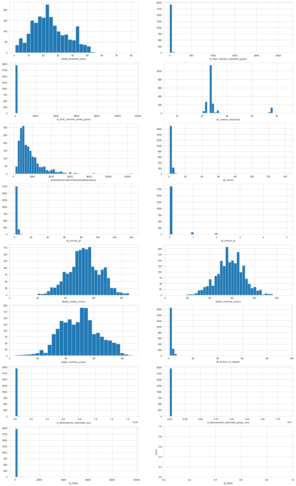


```python
create_barplots(recommended_dataset, object_features, n_labels=10)
```


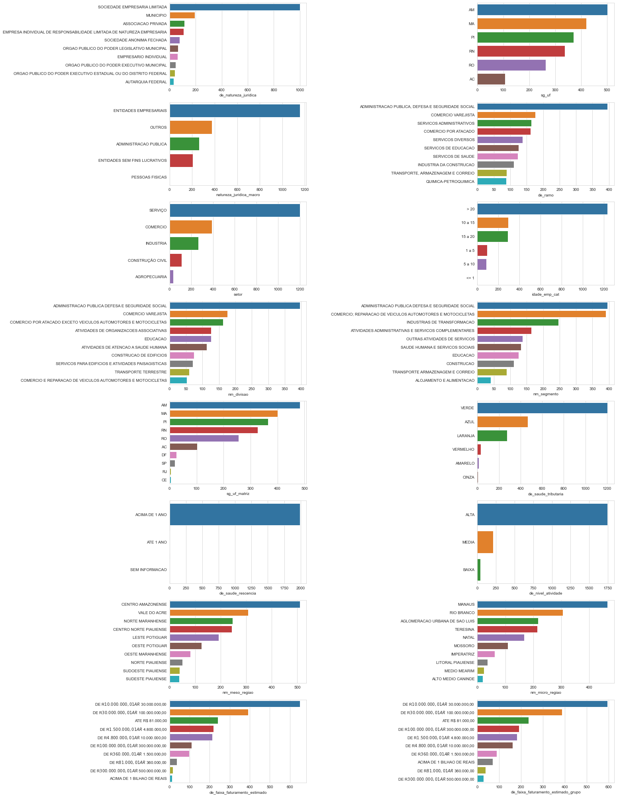


___  

[go back to top](#top)  

___  
  
## <a name="conclusion">7 Conclusion and Next Steps</a>  

The main objective was to recommend leads/new clients for companies based on their portfolios. The resulting model showed satisfactory metrics, and the recommendations for portfolio 2 presented interesting insights on it's preferred clients' characteristics. The next step is to develop a web-app of sorts to automate this process, e.g. to turn it user friendly. This project taught me a lot, and it gives insights on how to use many machine learning techniques.  
The problem stated that new leads should be generated, so classic recommender systems were the first approach that came to mind. It was not until later in the project that fellow colleagues and students gave me insight on reframing the problem - hence, I ended up applying logistic regression, a simpler ML technique, in conjunction to what I already had in mind, to create this recommender system's skeleton! This also taught me that correctly framing your problem is very important at early stages of the project.  

In summary:  
* Sometimes (if not always) simpler is better!  
* The community - felow peers, colleagues, students - is VERY IMPORTANT to data students! Get mingled!  
* To someone that only has a hammer, every problem seems like a nail - sometimes, it's not a single technique or concept that'll do the trick, in this process i've used several to accomplish the end result.  
* I've never used this much data before, and I know for a fact that it's not even close to real life Biggest of Datas.

What could be better:  
* A better/more profound early analysis of the dataset could have spared me a lot of time and RAM. I still think that many of the features used in the training weren't as necessary.  
* The number of Principal Components used in the logistic regression training is still quite high!  
    * The last point is one of the reasons I did not present the analysis of portfolio 1 and 3, but feel free to try the code laid here!
* I'm feeling that the use of Object Oriented Programming would help me a lot in this project, and I intent to fill this gap.  
* Also, my notebook couldn't handle some of my experiments, so maybe I also should learn about cloud technologies (as noted in the fourth point just above).  

Next steps:  
* Create a web-app to turn this skeleton of a system into a user friendly platform.  
* Learn more about Object Oriented Programming.  
* Learn more about cloud techonologies.  

___  

[go back to top](#top)  

___  

## <a name="refs">8 References</a>  

Most references are about classic recommender systems, which I actually did not use step by step, but the insights were very helpful.

[Simple Recommenders / Popularity Based System](https://www.datacamp.com/community/tutorials/recommender-systems-python)  
[Collaborative Filtering](https://en.wikipedia.org/wiki/Collaborative_filtering)  
[Content Based Fitering](http://recommender-systems.org/content-based-filtering/)  
[Hybrid Methods](https://en.wikipedia.org/wiki/Recommender_system#Hybrid_recommender_systems)  
[The Data Science Process - Part 2](http://drunkendatascience.com/the-data-science-process-post-2-defining-the-project/)  
[MAP@K](http://sdsawtelle.github.io/blog/output/mean-average-precision-MAP-for-recommender-systems.html)  
[Metrics package](https://github.com/benhamner/Metrics)    
[Evaluation Metrics fo Recommender Systems](https://towardsdatascience.com/evaluation-metrics-for-recommender-systems-df56c6611093)  
[Evaluating Recommender Systems](http://fastml.com/evaluating-recommender-systems/)  
[Mean Average Precision for Recommender Systems](http://sdsawtelle.github.io/blog/output/mean-average-precision-MAP-for-recommender-systems.html#Examples-and-Intuition-for-AP)  
[Recommender Systems in Python 101](https://www.kaggle.com/gspmoreira/recommender-systems-in-python-101#Evaluation)  
[Content Based Recommender](https://rpubs.com/tim-dim/recommender)  
[A Gentle Introduction to Recommender Systems](https://jessesw.com/Rec-System/)  
[Recommender Systems in Python - Part I: Content Based Filtering](https://heartbeat.fritz.ai/recommender-systems-with-python-part-i-content-based-filtering-5df4940bd831)  
[Recommender Systems in Practice](https://towardsdatascience.com/recommender-systems-in-practice-cef9033bb23a)  
[Begginer Tutorial: Recommender Systems in Python](https://www.datacamp.com/community/tutorials/recommender-systems-python)  
[Build a Recommendation Engine with Collaborative Filtering](https://realpython.com/build-recommendation-engine-collaborative-filtering/#using-python-to-build-recommenders)  
[Dive into Deep Learning](http://d2l.ai/chapter_recommender-systems/index.html)  
[SMOTE for Imbalanced Classification with Python](https://machinelearningmastery.com/smote-oversampling-for-imbalanced-classification/)

___  

### 9 THANK YOU FOR READING!   

Do you have any insights on how solve this differently or wish to know more?  
Message me @ [GitHub](https://github.com/Key0412) | [LinkedIn](https://www.linkedin.com/in/klismam-pereira/)

___  

#### [Go back to top](#top)[, one more time](https://www.youtube.com/watch?v=FGBhQbmPwH8)  

___  
